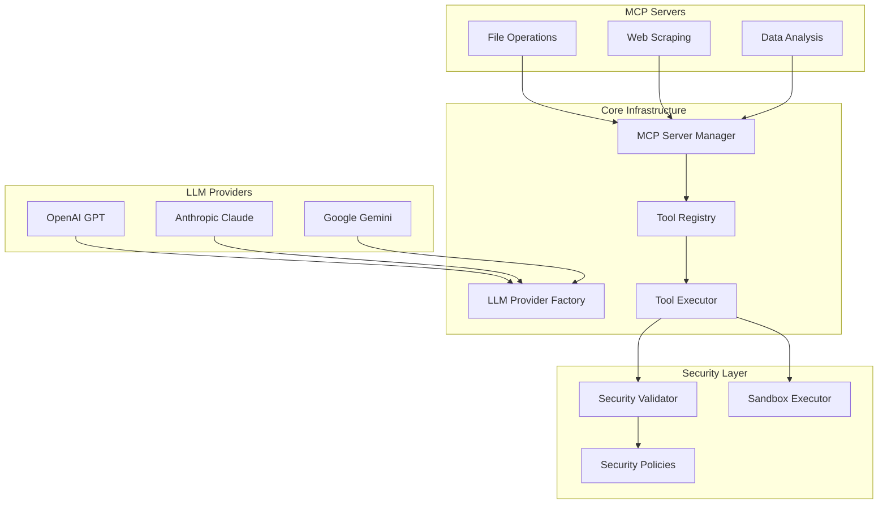

# Phase 5: External Service Integration

This document describes the comprehensive external service integration implementation for the AI Agent application, including LLM providers, MCP (Model Context Protocol) servers, and tool execution frameworks.

## Overview

Phase 5 implements a complete external service integration layer that provides:

- **LLM Provider Integration**: Support for OpenAI, Anthropic, and Google Gemini with unified interfaces
- **MCP Protocol Implementation**: Full Model Context Protocol support for tool discovery and execution
- **Tool Management**: Dynamic tool discovery, registration, and execution with security
- **Connection Pooling**: Efficient connection management and health monitoring
- **Security Framework**: Multi-level security policies and sandboxed execution

## Architecture



## Components

### 1. LLM Provider Integration

#### Base Architecture (`llm/base.py`)

The base LLM provider interface provides a unified API for all LLM providers:

```python
from ai_agent.infrastructure.llm import BaseLLMProvider, LLMRequest, LLMResponse

class MyProvider(BaseLLMProvider):
    async def generate(self, request: LLMRequest) -> LLMResponse:
        # Implementation here
        pass

    async def stream(self, request: LLMRequest) -> AsyncGenerator[LLMStreamChunk, None]:
        # Implementation here
        pass
```

#### Provider Implementations

**OpenAI Provider** (`llm/openai_client.py`)
- GPT-3.5, GPT-4, GPT-4 Vision support
- Function calling capabilities
- Streaming responses
- Azure OpenAI integration

**Anthropic Provider** (`llm/anthropic_client.py`)
- Claude 3 models (Opus, Sonnet, Haiku)
- Tool use capabilities
- Safety configurations
- Streaming support

**Google Provider** (`llm/google_client.py`)
- Gemini 1.5 models
- Multi-modal capabilities
- Safety settings
- Embedding support

#### Provider Factory (`llm/factory.py`)

```python
from ai_agent.infrastructure.llm import LLMProviderFactory

# Register providers
openai_id = await LLMProviderFactory.create_openai_provider(
    api_key="your-key",
    name="My OpenAI",
    default_model="gpt-4"
)

# Get best provider
provider = await get_llm_provider(provider_type=LLMProviderType.OPENAI)

# Generate response
response = await provider.generate(LLMRequest(
    messages=[{"role": "user", "content": "Hello!"}],
    model="gpt-4"
))
```

### 2. MCP Protocol Implementation

#### Protocol Core (`mcp/protocol.py`)

Full MCP protocol implementation with message handling:

```python
from ai_agent.infrastructure.mcp import MCPClient, MCPRequest, MCPResponse

class MyMCPClient(MCPClient):
    async def _send_message(self, message: MCPMessage) -> None:
        # Send via your transport
        pass

# Initialize and use
client = MyMCPClient()
await client.initialize()

# List tools
tools = await client.list_tools()

# Call tool
result = await client.call_tool("my_tool", {"arg": "value"})
```

#### Server Management (`mcp/server_manager.py`)

```python
from ai_agent.infrastructure.mcp import MCPServerManager, MCPServerType

manager = MCPServerManager()
await manager.start()

# Register server
server_id = await manager.register_server(
    name="File Server",
    server_type=MCPServerType.PROCESS,
    command=["python", "-m", "file_server"]
)

# Start server
await manager.start_server(server_id)

# Health check
is_healthy = await manager.health_check_server(server_id)
```

#### Connection Pooling (`mcp/client.py`)

```python
from ai_agent.infrastructure.mcp import MCPConnectionManager

connection_manager = MCPConnectionManager(max_connections=10)
await connection_manager.start()

# Get client for server
client = await connection_manager.get_client(server_id)

# Call tool
result = await connection_manager.call_tool(server_id, "tool_name", {})
```

### 3. Tool Management

#### Tool Registry (`mcp/tool_registry.py`)

```python
from ai_agent.infrastructure.mcp.tool_registry import (
    ToolRegistry, ToolCategory, ToolMetadata
)

registry = ToolRegistry()
await registry.start()

# Register tool with metadata
metadata = ToolMetadata(
    category=ToolCategory.FILE_OPERATIONS,
    tags=["file", "read"],
    rate_limit=100,
    timeout=30.0
)

await registry.register_tool(tool, server_id, metadata)

# Search tools
results = await registry.search_tools("file operations", limit=10)

# List by category
file_tools = await registry.list_tools(category=ToolCategory.FILE_OPERATIONS)
```

#### Tool Execution (`mcp/tool_executor.py`)

```python
from ai_agent.infrastructure.mcp.tool_executor import (
    ToolExecutor, SecurityLevel, ExecutionEnvironment, SecurityPolicy
)

executor = ToolExecutor()

# Create security policy
policy = SecurityPolicy(
    level=SecurityLevel.HIGH,
    environment=ExecutionEnvironment.SANDBOX,
    max_execution_time=30.0,
    network_access=False
)

# Execute tool
result = await executor.execute_tool(tool, arguments, context)

# Get execution stats
stats = await executor.get_execution_stats()
```

## Security Framework

### Security Levels

1. **LOW**: No restrictions, direct execution
2. **MEDIUM**: Basic input validation
3. **HIGH**: Sandboxed execution with restrictions
4. **CRITICAL**: Maximum restrictions, no file/network access

### Security Policies

```python
from ai_agent.infrastructure.mcp.tool_executor import SecurityPolicy, SecurityLevel

# High security policy
policy = SecurityPolicy(
    level=SecurityLevel.HIGH,
    environment=ExecutionEnvironment.SANDBOX,
    max_execution_time=30.0,
    max_memory_mb=512,
    network_access=False,
    file_system_access=True,
    allowed_file_extensions={".txt", ".json", ".csv"},
    blocked_operations={"rm", "sudo", "chmod"}
)
```

### Input Validation

The security validator checks for:
- Dangerous command patterns
- File system access restrictions
- Network operation limits
- Resource usage constraints
- Custom security rules

## Usage Examples

### Complete Integration Example

```python
import asyncio
from ai_agent.infrastructure.llm import LLMProviderFactory
from ai_agent.infrastructure.mcp import MCPServerManager, MCPConnectionManager
from ai_agent.infrastructure.mcp.tool_registry import ToolRegistry
from ai_agent.infrastructure.mcp.tool_executor import ToolExecutor

async def main():
    # Initialize all components
    llm_factory = LLMProviderFactory()
    server_manager = MCPServerManager()
    connection_manager = MCPConnectionManager()
    tool_registry = ToolRegistry()
    tool_executor = ToolExecutor()

    # Start components
    await server_manager.start()
    await connection_manager.start()
    await tool_registry.start()

    # Register LLM provider
    openai_id = await LLMProviderFactory.create_openai_provider(
        api_key="your-key",
        name="Main OpenAI"
    )

    # Register MCP server
    server_id = await server_manager.register_server(
        name="File Server",
        server_type=MCPServerType.PROCESS,
        command=["python", "-m", "file_server"]
    )

    # Start server
    await server_manager.start_server(server_id)

    # Discover tools
    tools = await tool_registry.discover_tools()
    print(f"Discovered {len(tools)} tools")

    # Execute tool
    if tools:
        tool = tools[0]
        result = await tool_executor.execute_tool(
            tool,
            {"path": "/tmp/test.txt"},
            ExecutionContext()
        )
        print(f"Tool result: {result}")

    # Clean up
    await tool_registry.stop()
    await connection_manager.stop()
    await server_manager.stop()

if __name__ == "__main__":
    asyncio.run(main())
```

### LLM Provider Usage

```python
from ai_agent.infrastructure.llm import get_llm_provider, LLMRequest

async def generate_response():
    # Get best available provider
    provider = await get_llm_provider()

    if provider:
        # Generate response
        response = await provider.generate(LLMRequest(
            messages=[{"role": "user", "content": "Hello!"}],
            model="gpt-4"
        ))

        print(f"Response: {response.content}")

        # Stream response
        async for chunk in provider.stream(LLMRequest(
            messages=[{"role": "user", "content": "Tell me a story"}],
            model="gpt-4",
            stream=True
        )):
            print(chunk.content, end="")
```

### Tool Execution with Security

```python
from ai_agent.infrastructure.mcp.tool_executor import (
    ToolExecutor, SecurityLevel, ExecutionEnvironment, SecurityPolicy
)

async def secure_tool_execution():
    executor = ToolExecutor()

    # Create high-security context
    context = ExecutionContext(
        user_id="user123",
        security_policy=SecurityPolicy(
            level=SecurityLevel.HIGH,
            environment=ExecutionEnvironment.SANDBOX,
            max_execution_time=30.0,
            network_access=False
        )
    )

    # Execute tool safely
    result = await executor.execute_tool(
        tool,
        {"command": "safe_operation"},
        context
    )

    if result.success:
        print(f"Tool executed successfully: {result.result}")
    else:
        print(f"Tool execution failed: {result.error}")
```

## Configuration

### Environment Variables

```bash
# LLM Provider Keys
OPENAI_API_KEY=your-openai-key
ANTHROPIC_API_KEY=your-anthropic-key
GOOGLE_API_KEY=your-google-key

# MCP Server Configuration
MCP_SERVER_TIMEOUT=30
MCP_MAX_CONNECTIONS=10
MCP_HEALTH_CHECK_INTERVAL=60

# Security Configuration
SECURITY_DEFAULT_LEVEL=medium
SECURITY_MAX_EXECUTION_TIME=30
SECURITY_MAX_MEMORY_MB=512
```

### Configuration Classes

```python
from ai_agent.infrastructure.llm import LLMProviderConfig
from ai_agent.infrastructure.mcp.tool_executor import SecurityPolicy

# LLM Provider Configuration
llm_config = LLMProviderConfig(
    provider_type=LLMProviderType.OPENAI,
    name="Production OpenAI",
    config={
        "api_key": "your-key",
        "default_model": "gpt-4",
        "timeout": 30.0
    },
    enabled=True,
    priority=1
)

# Security Policy Configuration
security_policy = SecurityPolicy(
    level=SecurityLevel.HIGH,
    environment=ExecutionEnvironment.SANDBOX,
    max_execution_time=30.0,
    max_memory_mb=512,
    network_access=False,
    file_system_access=True
)
```

## Monitoring and Observability

### Health Checks

```python
# Check LLM provider health
health_status = await health_check_all_providers()
print(f"LLM Health: {health_status}")

# Check MCP server health
server_health = await server_manager.health_check_all()
print(f"Server Health: {server_health}")

# Check tool registry health
tool_stats = await tool_registry.get_tool_stats()
print(f"Tool Stats: {tool_stats}")
```

### Metrics Collection

```python
# Get execution metrics
execution_stats = await tool_executor.get_execution_stats()
print(f"Execution Stats: {execution_stats}")

# Get connection metrics
connection_stats = await connection_manager.get_stats()
print(f"Connection Stats: {connection_stats}")
```

## Error Handling

The implementation includes comprehensive error handling:

- **LLM Errors**: Provider-specific error mapping and retry logic
- **MCP Errors**: Protocol-level error handling and recovery
- **Tool Errors**: Execution failure handling and fallback strategies
- **Security Errors**: Violation detection and prevention

## Testing

Run the comprehensive demo:

```bash
python examples/phase5_external_services_demo.py
```

This will demonstrate:
- LLM provider registration and usage
- MCP server management
- Tool discovery and registration
- Secure tool execution
- Complete integration workflow

## Dependencies

The implementation requires the following packages:

```toml
# LLM Providers
openai>=1.3.0
anthropic>=0.5.0
google-generativeai>=0.3.0

# HTTP and Async
httpx>=0.25.0
asyncio

# Security and Validation
pydantic>=2.5.0
```

## Future Enhancements

- **Additional LLM Providers**: Support for more providers (Cohere, Hugging Face, etc.)
- **Advanced Sandboxing**: Container-based and VM-based execution
- **Tool Caching**: Intelligent caching of tool results
- **Load Balancing**: Advanced load balancing across providers
- **Metrics Dashboard**: Real-time monitoring and alerting
- **Tool Marketplace**: Dynamic tool discovery and installation

This Phase 5 implementation provides a robust, secure, and scalable foundation for external service integration in the AI Agent application.
