# AI Agent Application Architecture Plan

## Executive Summary

This architecture plan defines a comprehensive, production-ready AI agent application built with Python 3.12+, LangGraph, MCP servers, and FastAPI. The system is designed for enterprise scalability, resilience, and maintainability with sophisticated external service integration patterns.

### Key Architecture Decisions

1. **Technology Stack**: FastAPI + LangGraph + Direct LLM SDKs + MCP Protocol
2. **Type Safety**: Pydantic v2 throughout for robust data validation
3. **Package Management**: UV for fast, reliable dependency management
4. **Persistence Strategy**: Configurable (Memory/Redis/PostgreSQL) based on environment
5. **Resilience First**: Built-in retry mechanisms, circuit breakers, and graceful degradation
6. **Cloud Native**: Docker-based deployment with Kubernetes support

### Architecture Principles

- **Resilience by Design**: Every external call has retry logic and circuit breakers
- **Type Safety First**: Strong typing with Pydantic v2 models throughout
- **Configuration Driven**: Runtime behavior controlled via environment-specific configs
- **Observability Native**: Comprehensive logging, metrics, and distributed tracing
- **API Complete**: Full CRUD operations with OpenAPI documentation
- **Real-Time Ready**: WebSocket support with event-driven architecture

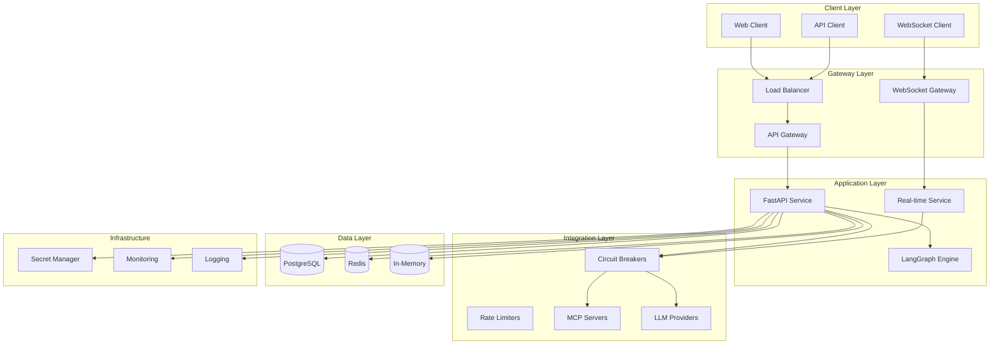

## 1. Domain Model

### Core Entities

```python
from datetime import datetime, timezone
from enum import Enum
from typing import Any, Dict, List, Optional, Union
from uuid import UUID, uuid4

from pydantic import BaseModel, Field, ConfigDict


class AgentStatus(str, Enum):
    """Agent execution status."""
    IDLE = "idle"
    PROCESSING = "processing"
    WAITING = "waiting"
    ERROR = "error"
    COMPLETED = "completed"


class MessageRole(str, Enum):
    """Message roles in conversation."""
    USER = "user"
    ASSISTANT = "assistant"
    SYSTEM = "system"
    TOOL = "tool"


class ExternalServiceType(str, Enum):
    """Types of external services."""
    LLM_PROVIDER = "llm_provider"
    MCP_SERVER = "mcp_server"
    DATABASE = "database"
    CACHE = "cache"
    SECRET_MANAGER = "secret_manager"
    MESSAGE_QUEUE = "message_queue"


class CircuitBreakerState(str, Enum):
    """Circuit breaker states."""
    CLOSED = "closed"
    OPEN = "open"
    HALF_OPEN = "half_open"


# Base Models
class TimestampedModel(BaseModel):
    """Base model with timestamps."""
    model_config = ConfigDict(
        str_strip_whitespace=True,
        validate_assignment=True,
        use_enum_values=True,
        extra="forbid"
    )

    created_at: datetime = Field(default_factory=lambda: datetime.now(timezone.utc))
    updated_at: datetime = Field(default_factory=lambda: datetime.now(timezone.utc))


class IdentifiedModel(TimestampedModel):
    """Base model with ID and timestamps."""
    id: UUID = Field(default_factory=uuid4)


# Domain Entities
class Message(IdentifiedModel):
    """Conversation message."""
    session_id: UUID
    role: MessageRole
    content: str
    metadata: Dict[str, Any] = Field(default_factory=dict)
    tool_calls: List[Dict[str, Any]] = Field(default_factory=list)
    parent_message_id: Optional[UUID] = None


class Session(IdentifiedModel):
    """User conversation session."""
    user_id: Optional[str] = None
    title: Optional[str] = None
    metadata: Dict[str, Any] = Field(default_factory=dict)
    message_count: int = 0
    last_activity: datetime = Field(default_factory=lambda: datetime.now(timezone.utc))


class Agent(IdentifiedModel):
    """AI agent configuration."""
    name: str
    description: Optional[str] = None
    system_prompt: Optional[str] = None
    model_config: Dict[str, Any] = Field(default_factory=dict)
    tools: List[str] = Field(default_factory=list)
    status: AgentStatus = AgentStatus.IDLE
    metadata: Dict[str, Any] = Field(default_factory=dict)


class Tool(IdentifiedModel):
    """Tool available to agents."""
    name: str
    description: str
    schema: Dict[str, Any]
    mcp_server_id: Optional[UUID] = None
    enabled: bool = True
    metadata: Dict[str, Any] = Field(default_factory=dict)


class MCPServer(IdentifiedModel):
    """MCP server configuration."""
    name: str
    description: Optional[str] = None
    endpoint: str
    authentication: Dict[str, Any] = Field(default_factory=dict)
    capabilities: List[str] = Field(default_factory=list)
    health_check_url: Optional[str] = None
    enabled: bool = True


class ExternalService(IdentifiedModel):
    """External service configuration."""
    name: str
    service_type: ExternalServiceType
    endpoint: str
    authentication: Dict[str, Any] = Field(default_factory=dict)
    retry_config: Dict[str, Any] = Field(default_factory=dict)
    circuit_breaker_config: Dict[str, Any] = Field(default_factory=dict)
    health_check_url: Optional[str] = None
    enabled: bool = True


# Error Handling Models
class ErrorCode(str, Enum):
    """Standardized error codes."""
    VALIDATION_ERROR = "validation_error"
    AUTHENTICATION_ERROR = "authentication_error"
    AUTHORIZATION_ERROR = "authorization_error"
    RATE_LIMIT_ERROR = "rate_limit_error"
    EXTERNAL_SERVICE_ERROR = "external_service_error"
    CIRCUIT_BREAKER_OPEN = "circuit_breaker_open"
    TIMEOUT_ERROR = "timeout_error"
    INTERNAL_ERROR = "internal_error"


class ErrorDetail(BaseModel):
    """Detailed error information."""
    code: ErrorCode
    message: str
    details: Dict[str, Any] = Field(default_factory=dict)
    retry_after: Optional[int] = None
    correlation_id: Optional[str] = None


# Request/Response Models
class CreateSessionRequest(BaseModel):
    """Request to create a new session."""
    user_id: Optional[str] = None
    title: Optional[str] = None
    metadata: Dict[str, Any] = Field(default_factory=dict)


class CreateMessageRequest(BaseModel):
    """Request to create a new message."""
    content: str
    role: MessageRole = MessageRole.USER
    metadata: Dict[str, Any] = Field(default_factory=dict)


class AgentExecutionRequest(BaseModel):
    """Request for agent execution."""
    session_id: UUID
    message: str
    agent_id: Optional[UUID] = None
    stream: bool = False
    metadata: Dict[str, Any] = Field(default_factory=dict)


class AgentExecutionResponse(BaseModel):
    """Response from agent execution."""
    session_id: UUID
    message_id: UUID
    content: str
    metadata: Dict[str, Any] = Field(default_factory=dict)
    tool_calls: List[Dict[str, Any]] = Field(default_factory=list)
    execution_time_ms: int


# Resilience Models
class RetryConfig(BaseModel):
    """Retry configuration for external services."""
    max_attempts: int = 3
    base_delay: float = 1.0
    max_delay: float = 60.0
    multiplier: float = 2.0
    jitter: bool = True
    retryable_errors: List[str] = Field(default_factory=list)


class CircuitBreakerConfig(BaseModel):
    """Circuit breaker configuration."""
    failure_threshold: int = 5
    recovery_timeout: float = 60.0
    expected_exception: List[str] = Field(default_factory=list)
    fallback_enabled: bool = True


class ServiceHealth(BaseModel):
    """Service health status."""
    service_name: str
    service_type: ExternalServiceType
    status: str
    last_check: datetime
    error_count: int = 0
    success_count: int = 0
    circuit_breaker_state: CircuitBreakerState = CircuitBreakerState.CLOSED
    metadata: Dict[str, Any] = Field(default_factory=dict)
```

### Entity Relationship Diagram

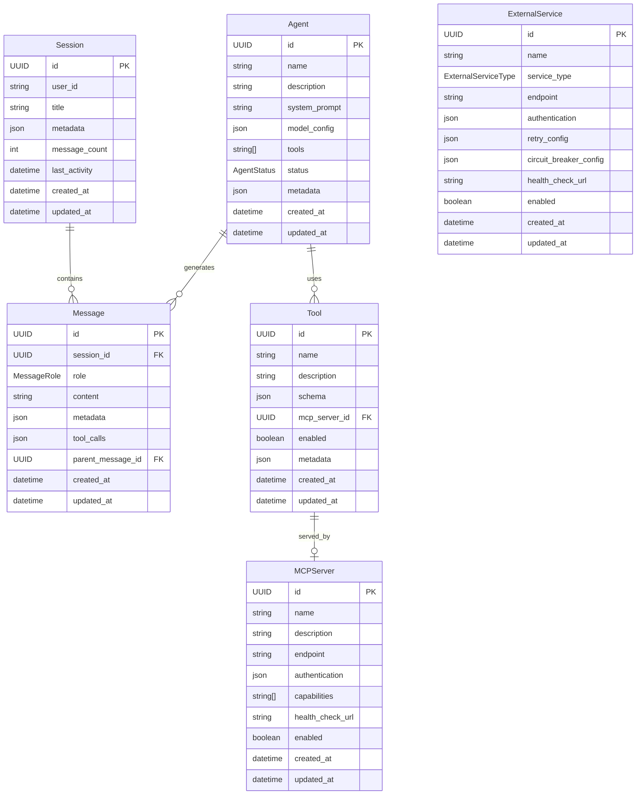

### Exception Hierarchy

```python
class AIAgentException(Exception):
    """Base exception for AI agent application."""

    def __init__(
        self,
        message: str,
        error_code: ErrorCode,
        details: Optional[Dict[str, Any]] = None,
        correlation_id: Optional[str] = None
    ):
        super().__init__(message)
        self.error_code = error_code
        self.details = details or {}
        self.correlation_id = correlation_id


class ValidationException(AIAgentException):
    """Validation error exception."""

    def __init__(self, message: str, field: str, value: Any):
        super().__init__(
            message,
            ErrorCode.VALIDATION_ERROR,
            {"field": field, "value": str(value)}
        )


class AuthenticationException(AIAgentException):
    """Authentication error exception."""

    def __init__(self, message: str = "Authentication failed"):
        super().__init__(message, ErrorCode.AUTHENTICATION_ERROR)


class AuthorizationException(AIAgentException):
    """Authorization error exception."""

    def __init__(self, message: str = "Authorization failed"):
        super().__init__(message, ErrorCode.AUTHORIZATION_ERROR)


class RateLimitException(AIAgentException):
    """Rate limit exceeded exception."""

    def __init__(self, message: str, retry_after: Optional[int] = None):
        super().__init__(message, ErrorCode.RATE_LIMIT_ERROR)
        self.retry_after = retry_after


class ExternalServiceException(AIAgentException):
    """External service error exception."""

    def __init__(
        self,
        message: str,
        service_name: str,
        service_type: ExternalServiceType,
        is_retryable: bool = True
    ):
        super().__init__(
            message,
            ErrorCode.EXTERNAL_SERVICE_ERROR,
            {"service_name": service_name, "service_type": service_type, "is_retryable": is_retryable}
        )
        self.is_retryable = is_retryable


class CircuitBreakerOpenException(AIAgentException):
    """Circuit breaker open exception."""

    def __init__(self, service_name: str):
        super().__init__(
            f"Circuit breaker open for service: {service_name}",
            ErrorCode.CIRCUIT_BREAKER_OPEN,
            {"service_name": service_name}
        )


class TimeoutException(AIAgentException):
    """Timeout error exception."""

    def __init__(self, message: str, timeout_duration: float):
        super().__init__(
            message,
            ErrorCode.TIMEOUT_ERROR,
            {"timeout_duration": timeout_duration}
        )
```


## 2. Project Structure

### Complete Folder Hierarchy

```
ai-agent-app/
├── src/
│   └── ai_agent/
│       ├── __init__.py
│       ├── main.py                      # FastAPI application entry point
│       ├── api/                         # REST API layer
│       │   ├── __init__.py
│       │   ├── dependencies.py          # FastAPI dependencies
│       │   ├── middleware.py            # Custom middleware
│       │   ├── v1/                      # API versioning
│       │   │   ├── __init__.py
│       │   │   ├── router.py            # Main API router
│       │   │   ├── agents.py            # Agent CRUD endpoints
│       │   │   ├── sessions.py          # Session management endpoints
│       │   │   ├── messages.py          # Message endpoints
│       │   │   ├── tools.py             # Tool management endpoints
│       │   │   ├── mcp_servers.py       # MCP server endpoints
│       │   │   └── health.py            # Health check endpoints
│       │   └── websocket/               # WebSocket handlers
│       │       ├── __init__.py
│       │       ├── connection_manager.py
│       │       ├── event_handlers.py
│       │       └── auth.py
│       ├── core/                        # Core business logic
│       │   ├── __init__.py
│       │   ├── agents/                  # Agent management
│       │   │   ├── __init__.py
│       │   │   ├── service.py
│       │   │   ├── repository.py
│       │   │   └── execution_engine.py
│       │   ├── sessions/                # Session management
│       │   │   ├── __init__.py
│       │   │   ├── service.py
│       │   │   └── repository.py
│       │   ├── messages/                # Message handling
│       │   │   ├── __init__.py
│       │   │   ├── service.py
│       │   │   └── repository.py
│       │   ├── tools/                   # Tool management
│       │   │   ├── __init__.py
│       │   │   ├── service.py
│       │   │   ├── repository.py
│       │   │   └── registry.py
│       │   └── workflows/               # LangGraph workflows
│       │       ├── __init__.py
│       │       ├── graph_builder.py
│       │       ├── nodes/
│       │       │   ├── __init__.py
│       │       │   ├── llm_node.py
│       │       │   ├── tool_node.py
│       │       │   └── decision_node.py
│       │       └── state.py
│       ├── domain/                      # Domain models (from above)
│       │   ├── __init__.py
│       │   ├── models.py
│       │   ├── exceptions.py
│       │   └── events.py
│       ├── infrastructure/              # External integrations
│       │   ├── __init__.py
│       │   ├── database/                # Database layer
│       │   │   ├── __init__.py
│       │   │   ├── base.py
│       │   │   ├── postgresql.py
│       │   │   ├── redis.py
│       │   │   ├── memory.py
│       │   │   └── migrations/
│       │   ├── mcp/                     # MCP protocol integration
│       │   │   ├── __init__.py
│       │   │   ├── client.py
│       │   │   ├── server_manager.py
│       │   │   └── protocol.py
│       │   ├── llm/                     # LLM provider integrations
│       │   │   ├── __init__.py
│       │   │   ├── base.py
│       │   │   ├── openai_client.py
│       │   │   ├── anthropic_client.py
│       │   │   ├── google_client.py
│       │   │   └── factory.py
│       │   ├── secrets/                 # Secret management
│       │   │   ├── __init__.py
│       │   │   ├── base.py
│       │   │   ├── aws_secrets.py
│       │   │   ├── azure_keyvault.py
│       │   │   ├── gcp_secrets.py
│       │   │   ├── local_secrets.py
│       │   │   └── factory.py
│       │   └── messaging/               # Event messaging
│       │       ├── __init__.py
│       │       ├── publisher.py
│       │       ├── subscriber.py
│       │       └── events.py
│       ├── resilience/                  # Resilience patterns
│       │   ├── __init__.py
│       │   ├── retry/                   # Retry mechanisms
│       │   │   ├── __init__.py
│       │   │   ├── decorators.py
│       │   │   ├── config.py
│       │   │   └── strategies.py
│       │   ├── circuit_breaker/         # Circuit breaker implementation
│       │   │   ├── __init__.py
│       │   │   ├── breaker.py
│       │   │   ├── state_manager.py
│       │   │   └── metrics.py
│       │   ├── rate_limiting/           # Rate limiting
│       │   │   ├── __init__.py
│       │   │   ├── limiter.py
│       │   │   ├── strategies.py
│       │   │   └── storage.py
│       │   ├── fallback/                # Fallback strategies
│       │   │   ├── __init__.py
│       │   │   ├── handlers.py
│       │   │   └── strategies.py
│       │   └── health/                  # Health checking
│       │       ├── __init__.py
│       │       ├── checker.py
│       │       └── monitors.py
│       ├── observability/               # Monitoring and logging
│       │   ├── __init__.py
│       │   ├── logging/
│       │   │   ├── __init__.py
│       │   │   ├── config.py
│       │   │   ├── formatters.py
│       │   │   └── correlation.py
│       │   ├── metrics/
│       │   │   ├── __init__.py
│       │   │   ├── collectors.py
│       │   │   ├── exporters.py
│       │   │   └── custom_metrics.py
│       │   └── tracing/
│       │       ├── __init__.py
│       │       ├── tracer.py
│       │       └── spans.py
│       ├── config/                      # Configuration management
│       │   ├── __init__.py
│       │   ├── settings.py              # Pydantic settings
│       │   ├── environments/            # Environment configs
│       │   │   ├── __init__.py
│       │   │   ├── development.py
│       │   │   ├── staging.py
│       │   │   ├── production.py
│       │   │   └── testing.py
│       │   └── feature_flags.py         # Feature flag management
│       └── utils/                       # Utility functions
│           ├── __init__.py
│           ├── datetime_utils.py
│           ├── validation.py
│           ├── security.py
│           └── helpers.py
├── tests/                               # Test suite
│   ├── __init__.py
│   ├── conftest.py                      # Pytest configuration
│   ├── unit/                            # Unit tests
│   │   ├── __init__.py
│   │   ├── test_domain/
│   │   ├── test_core/
│   │   ├── test_resilience/
│   │   └── test_utils/
│   ├── integration/                     # Integration tests
│   │   ├── __init__.py
│   │   ├── test_api/
│   │   ├── test_database/
│   │   ├── test_mcp/
│   │   └── test_external_services/
│   ├── e2e/                            # End-to-end tests
│   │   ├── __init__.py
│   │   ├── test_agent_workflows/
│   │   └── test_websocket/
│   ├── resilience/                      # Resilience testing
│   │   ├── __init__.py
│   │   ├── test_chaos/
│   │   ├── test_load/
│   │   └── test_failure_scenarios/
│   └── fixtures/                        # Test fixtures
│       ├── __init__.py
│       ├── agents.py
│       ├── sessions.py
│       └── external_services.py
├── docker/                              # Docker configurations
│   ├── Dockerfile.dev                  # Development dockerfile
│   ├── Dockerfile.prod                 # Production dockerfile
│   └── docker-compose.yml              # Local development setup
├── k8s/                                 # Kubernetes manifests
│   ├── namespace.yaml
│   ├── configmap.yaml
│   ├── secret.yaml
│   ├── deployment.yaml
│   ├── service.yaml
│   ├── ingress.yaml
│   ├── hpa.yaml                        # Horizontal Pod Autoscaler
│   └── monitoring/
│       ├── servicemonitor.yaml
│       └── prometheusrule.yaml
├── scripts/                             # Utility scripts
│   ├── start_dev.sh                    # Development startup
│   ├── start_prod.sh                   # Production startup
│   ├── migrate.py                      # Database migrations
│   ├── seed_data.py                    # Sample data seeding
│   └── health_check.py                 # Health check script
├── docs/                               # Documentation
│   ├── api/                            # API documentation
│   ├── architecture/                   # Architecture docs
│   ├── deployment/                     # Deployment guides
│   └── development/                    # Development guides
├── .github/                            # GitHub Actions
│   └── workflows/
│       ├── ci.yml
│       ├── cd.yml
│       └── security.yml
├── pyproject.toml                      # Project configuration
├── uv.lock                            # UV lock file
├── README.md                          # Project documentation
├── CHANGELOG.md                       # Change log
├── .gitignore                         # Git ignore rules
├── .dockerignore                      # Docker ignore rules
├── .env.example                       # Environment template
└── Makefile                           # Development commands
```

### Architecture Layer Diagram

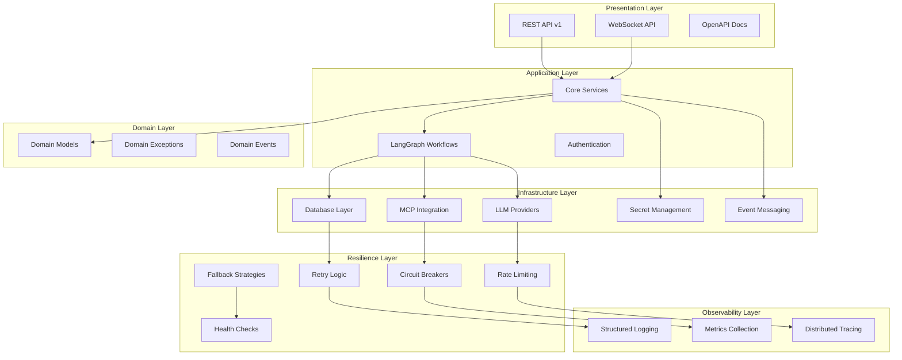

### Separation of Concerns

#### Presentation Layer (API)
- **Responsibility**: HTTP/WebSocket request handling, response formatting
- **Dependencies**: Application layer services only
- **Testing**: API integration tests, contract testing

#### Application Layer (Core)
- **Responsibility**: Business logic orchestration, workflow coordination
- **Dependencies**: Domain models, infrastructure services
- **Testing**: Unit tests with mocked dependencies

#### Domain Layer
- **Responsibility**: Business entities, rules, and domain logic
- **Dependencies**: No external dependencies (pure Python)
- **Testing**: Pure unit tests, property-based testing

#### Infrastructure Layer
- **Responsibility**: External service integration, data persistence
- **Dependencies**: External SDKs, database drivers
- **Testing**: Integration tests with real/mocked external services

#### Resilience Layer
- **Responsibility**: Failure handling, service reliability patterns
- **Dependencies**: Infrastructure layer services
- **Testing**: Chaos engineering, failure injection testing

#### Observability Layer
- **Responsibility**: Monitoring, logging, metrics collection
- **Dependencies**: All other layers (cross-cutting concern)
- **Testing**: Log verification, metrics validation


## 3. Technology Stack

### Core Framework Stack

| Component | Technology | Version | Justification |
|-----------|------------|---------|---------------|
| **Web Framework** | FastAPI | 0.104+ | High performance, automatic OpenAPI docs, excellent async support |
| **Python Version** | Python | 3.12+ | Latest language features, improved performance, better type hints |
| **Package Manager** | UV | 0.1.35+ | Fastest Python package installer, reliable lock files |
| **Workflow Engine** | LangGraph | 0.0.40+ | Graph-based workflow orchestration for AI agents |
| **Validation** | Pydantic | 2.5+ | Runtime type validation, settings management |
| **ASGI Server** | Uvicorn | 0.24+ | High-performance ASGI implementation |

### Resilience & External Service Libraries

| Component | Technology | Version | Purpose |
|-----------|------------|---------|---------|
| **Retry Logic** | tenacity | 8.2+ | Sophisticated retry mechanisms with exponential backoff |
| **Circuit Breaker** | pybreaker | 1.0+ | Circuit breaker pattern implementation |
| **Rate Limiting** | slowapi | 0.1+ | FastAPI-compatible rate limiting |
| **HTTP Client** | httpx | 0.25+ | Async HTTP client with timeout and retry support |
| **Async Utils** | anyio | 4.0+ | Structured concurrency and cancellation |

### Database & Persistence

| Component | Technology | Version | Purpose |
|-----------|------------|---------|---------|
| **PostgreSQL Driver** | asyncpg | 0.29+ | High-performance async PostgreSQL driver |
| **Redis Client** | redis-py | 5.0+ | Redis client with connection pooling |
| **Database Migrations** | alembic | 1.12+ | Database schema versioning |
| **Connection Pooling** | sqlalchemy | 2.0+ | Database toolkit and ORM |

### LLM Provider Integrations

| Provider | SDK | Version | Features |
|----------|-----|---------|----------|
| **OpenAI** | openai | 1.3+ | GPT models, function calling, streaming |
| **Anthropic** | anthropic | 0.5+ | Claude models, tool use |
| **Google** | google-generativeai | 0.3+ | Gemini models, safety settings |
| **Azure OpenAI** | openai | 1.3+ | Enterprise OpenAI with Azure integration |

### Secret Management

| Provider | SDK | Version | Purpose |
|----------|-----|---------|---------|
| **AWS Secrets** | boto3 | 1.34+ | AWS Secrets Manager integration |
| **Azure KeyVault** | azure-keyvault-secrets | 4.7+ | Azure Key Vault integration |
| **GCP Secrets** | google-cloud-secret-manager | 2.18+ | Google Cloud Secret Manager |
| **Local Development** | python-dotenv | 1.0+ | Environment variable management |

### Observability Stack

| Component | Technology | Version | Purpose |
|-----------|------------|---------|---------|
| **Structured Logging** | structlog | 23.2+ | Structured logging with correlation IDs |
| **Metrics** | prometheus-client | 0.19+ | Prometheus metrics exposition |
| **Distributed Tracing** | opentelemetry-api | 1.21+ | OpenTelemetry tracing |
| **Health Checks** | fastapi-health | 0.4+ | Application health monitoring |

### Testing Framework

| Component | Technology | Version | Purpose |
|-----------|------------|---------|---------|
| **Test Framework** | pytest | 7.4+ | Testing framework with fixtures |
| **Async Testing** | pytest-asyncio | 0.21+ | Async test support |
| **HTTP Testing** | httpx | 0.25+ | Async HTTP client for API testing |
| **Mocking** | pytest-mock | 3.12+ | Mocking and patching utilities |
| **Coverage** | pytest-cov | 4.1+ | Code coverage reporting |
| **Load Testing** | locust | 2.17+ | Load testing framework |
| **Chaos Testing** | chaos-toolkit | 1.17+ | Chaos engineering toolkit |

### Development Tools

| Component | Technology | Version | Purpose |
|-----------|------------|---------|---------|
| **Type Checking** | mypy | 1.7+ | Static type checking |
| **Code Formatting** | black | 23.11+ | Code formatting |
| **Import Sorting** | isort | 5.12+ | Import statement sorting |
| **Linting** | ruff | 0.1.6+ | Fast Python linter |
| **Pre-commit** | pre-commit | 3.5+ | Git pre-commit hooks |

### Container & Deployment

| Component | Technology | Version | Purpose |
|-----------|------------|---------|---------|
| **Container Runtime** | Docker | 24.0+ | Containerization |
| **Orchestration** | Kubernetes | 1.28+ | Container orchestration |
| **Service Mesh** | Istio | 1.19+ | Traffic management and security |
| **Ingress** | NGINX Ingress | 1.9+ | Load balancing and SSL termination |

### Complete pyproject.toml Configuration

```toml
[project]
name = "ai-agent-app"
version = "0.1.0"
description = "Production-ready AI agent application with LangGraph and MCP"
readme = "README.md"
requires-python = ">=3.12"
license = {text = "MIT"}
authors = [
    {name = "Your Team", email = "team@company.com"}
]
keywords = ["ai", "agent", "langgraph", "mcp", "fastapi"]
classifiers = [
    "Development Status :: 4 - Beta",
    "Intended Audience :: Developers",
    "License :: OSI Approved :: MIT License",
    "Programming Language :: Python :: 3.12",
    "Framework :: FastAPI",
    "Topic :: Scientific/Engineering :: Artificial Intelligence",
]

dependencies = [
    # Core Framework
    "fastapi>=0.104.0",
    "uvicorn[standard]>=0.24.0",
    "pydantic>=2.5.0",
    "pydantic-settings>=2.1.0",

    # Workflow Engine
    "langgraph>=0.0.40",
    "langchain-core>=0.1.0",  # Required by LangGraph

    # Resilience & HTTP
    "tenacity>=8.2.0",
    "pybreaker>=1.0.0",
    "slowapi>=0.1.9",
    "httpx>=0.25.0",
    "anyio>=4.0.0",

    # Database & Persistence
    "asyncpg>=0.29.0",
    "redis[hiredis]>=5.0.0",
    "sqlalchemy[asyncio]>=2.0.0",
    "alembic>=1.12.0",

    # LLM Providers
    "openai>=1.3.0",
    "anthropic>=0.5.0",
    "google-generativeai>=0.3.0",

    # Secret Management
    "boto3>=1.34.0",
    "azure-keyvault-secrets>=4.7.0",
    "google-cloud-secret-manager>=2.18.0",
    "python-dotenv>=1.0.0",

    # Observability
    "structlog>=23.2.0",
    "prometheus-client>=0.19.0",
    "opentelemetry-api>=1.21.0",
    "opentelemetry-sdk>=1.21.0",
    "opentelemetry-instrumentation-fastapi>=0.42.0",
    "opentelemetry-instrumentation-httpx>=0.42.0",
    "opentelemetry-instrumentation-redis>=0.42.0",
    "opentelemetry-instrumentation-sqlalchemy>=0.42.0",

    # Utilities
    "python-multipart>=0.0.6",  # File uploads
    "python-jose[cryptography]>=3.3.0",  # JWT handling
    "passlib[bcrypt]>=1.7.4",  # Password hashing
    "email-validator>=2.1.0",  # Email validation
]

[project.optional-dependencies]
dev = [
    # Testing
    "pytest>=7.4.0",
    "pytest-asyncio>=0.21.0",
    "pytest-mock>=3.12.0",
    "pytest-cov>=4.1.0",
    "locust>=2.17.0",
    "chaos-toolkit>=1.17.0",

    # Development Tools
    "mypy>=1.7.0",
    "black>=23.11.0",
    "isort>=5.12.0",
    "ruff>=0.1.6",
    "pre-commit>=3.5.0",

    # Documentation
    "mkdocs>=1.5.0",
    "mkdocs-material>=9.4.0",
    "mkdocstrings[python]>=0.24.0",
]

production = [
    # Production monitoring
    "sentry-sdk[fastapi]>=1.38.0",
    "gunicorn>=21.2.0",
]

[build-system]
requires = ["hatchling"]
build-backend = "hatchling.build"

[tool.hatch.build.targets.wheel]
packages = ["src/ai_agent"]

[tool.black]
line-length = 88
target-version = ['py312']
include = '\.pyi?$'
extend-exclude = '''
/(
  # directories
  \.eggs
  | \.git
  | \.hg
  | \.mypy_cache
  | \.tox
  | \.venv
  | build
  | dist
)/
'''

[tool.isort]
profile = "black"
multi_line_output = 3
line_length = 88
known_first_party = ["ai_agent"]

[tool.mypy]
python_version = "3.12"
warn_return_any = true
warn_unused_configs = true
disallow_untyped_defs = true
disallow_incomplete_defs = true
check_untyped_defs = true
disallow_untyped_decorators = true
no_implicit_optional = true
warn_redundant_casts = true
warn_unused_ignores = true
warn_no_return = true
warn_unreachable = true
strict_equality = true

[[tool.mypy.overrides]]
module = [
    "langgraph.*",
    "langchain_core.*",
    "pybreaker.*",
    "slowapi.*",
    "chaos_toolkit.*",
]
ignore_missing_imports = true

[tool.ruff]
target-version = "py312"
line-length = 88
select = [
    "E",  # pycodestyle errors
    "W",  # pycodestyle warnings
    "F",  # pyflakes
    "I",  # isort
    "B",  # flake8-bugbear
    "C4", # flake8-comprehensions
    "UP", # pyupgrade
]
ignore = [
    "E501",  # line too long, handled by black
    "B008",  # do not perform function calls in argument defaults
    "C901",  # too complex
]

[tool.ruff.per-file-ignores]
"__init__.py" = ["F401"]
"tests/*" = ["B011"]

[tool.pytest.ini_options]
minversion = "7.0"
addopts = "-ra -q --strict-markers --strict-config"
testpaths = ["tests"]
python_files = ["test_*.py", "*_test.py"]
python_classes = ["Test*"]
python_functions = ["test_*"]
markers = [
    "unit: marks tests as unit tests",
    "integration: marks tests as integration tests",
    "e2e: marks tests as end-to-end tests",
    "resilience: marks tests as resilience tests",
    "slow: marks tests as slow running",
]
asyncio_mode = "auto"

[tool.coverage.run]
source = ["src"]
omit = [
    "*/tests/*",
    "*/conftest.py",
    "*/__init__.py",
]

[tool.coverage.report]
precision = 2
show_missing = true
skip_covered = false
exclude_lines = [
    "pragma: no cover",
    "def __repr__",
    "raise AssertionError",
    "raise NotImplementedError",
    "if __name__ == .__main__.:",
    "if TYPE_CHECKING:",
]
```

### Technology Decision Matrix

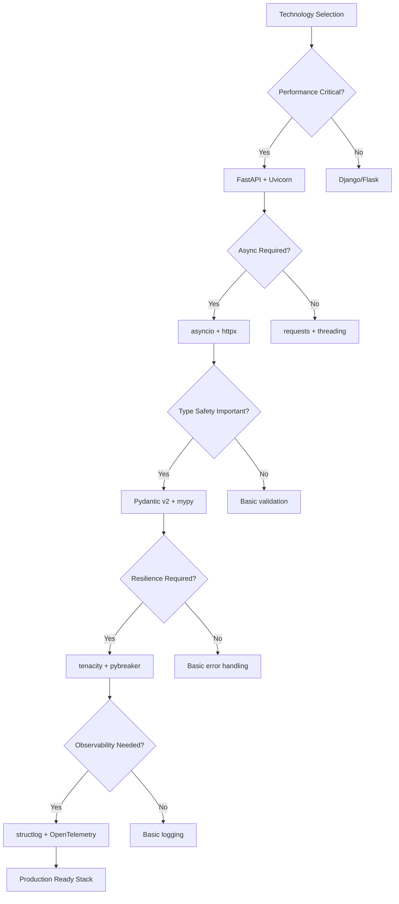


## 4. Configuration Strategy

### Environment-Specific Configuration

```python
from enum import Enum
from typing import Any, Dict, List, Optional, Union
from pydantic import Field, validator
from pydantic_settings import BaseSettings, SettingsConfigDict


class Environment(str, Enum):
    """Deployment environments."""
    DEVELOPMENT = "development"
    TESTING = "testing"
    STAGING = "staging"
    PRODUCTION = "production"


class LogLevel(str, Enum):
    """Logging levels."""
    DEBUG = "DEBUG"
    INFO = "INFO"
    WARNING = "WARNING"
    ERROR = "ERROR"
    CRITICAL = "CRITICAL"


class DatabaseSettings(BaseSettings):
    """Database configuration."""
    model_config = SettingsConfigDict(
        env_prefix="DB_",
        env_file=".env",
        extra="ignore"
    )

    # Connection settings
    host: str = "localhost"
    port: int = 5432
    name: str = "ai_agent"
    user: str = "postgres"
    password: str = ""

    # Connection pool settings
    min_pool_size: int = 5
    max_pool_size: int = 20
    pool_timeout: float = 30.0

    # SQLAlchemy settings
    echo: bool = False
    echo_pool: bool = False

    @property
    def url(self) -> str:
        """Database connection URL."""
        return f"postgresql+asyncpg://{self.user}:{self.password}@{self.host}:{self.port}/{self.name}"


class RedisSettings(BaseSettings):
    """Redis configuration."""
    model_config = SettingsConfigDict(
        env_prefix="REDIS_",
        env_file=".env",
        extra="ignore"
    )

    host: str = "localhost"
    port: int = 6379
    db: int = 0
    password: Optional[str] = None

    # Connection pool settings
    max_connections: int = 20
    retry_on_timeout: bool = True
    health_check_interval: int = 30

    @property
    def url(self) -> str:
        """Redis connection URL."""
        auth = f":{self.password}@" if self.password else ""
        return f"redis://{auth}{self.host}:{self.port}/{self.db}"


class RetrySettings(BaseSettings):
    """Retry configuration for external services."""
    model_config = SettingsConfigDict(
        env_prefix="RETRY_",
        env_file=".env",
        extra="ignore"
    )

    # LLM API settings
    llm_max_attempts: int = 3
    llm_base_delay: float = 1.0
    llm_max_delay: float = 60.0
    llm_multiplier: float = 2.0

    # Database settings
    db_max_attempts: int = 5
    db_base_delay: float = 0.5
    db_max_delay: float = 30.0
    db_multiplier: float = 1.5

    # MCP server settings
    mcp_max_attempts: int = 3
    mcp_base_delay: float = 2.0
    mcp_max_delay: float = 120.0
    mcp_multiplier: float = 2.0

    # Secret manager settings
    secret_max_attempts: int = 2
    secret_base_delay: float = 1.0
    secret_max_delay: float = 10.0
    secret_multiplier: float = 2.0


class CircuitBreakerSettings(BaseSettings):
    """Circuit breaker configuration."""
    model_config = SettingsConfigDict(
        env_prefix="CIRCUIT_",
        env_file=".env",
        extra="ignore"
    )

    # LLM API circuit breaker
    llm_failure_threshold: int = 5
    llm_recovery_timeout: float = 60.0
    llm_expected_exception: List[str] = Field(default_factory=lambda: ["httpx.TimeoutException", "openai.RateLimitError"])

    # Database circuit breaker
    db_failure_threshold: int = 3
    db_recovery_timeout: float = 30.0
    db_expected_exception: List[str] = Field(default_factory=lambda: ["asyncpg.exceptions.ConnectionDoesNotExistError"])

    # MCP server circuit breaker
    mcp_failure_threshold: int = 3
    mcp_recovery_timeout: float = 120.0
    mcp_expected_exception: List[str] = Field(default_factory=lambda: ["httpx.ConnectError", "httpx.TimeoutException"])


class RateLimitSettings(BaseSettings):
    """Rate limiting configuration."""
    model_config = SettingsConfigDict(
        env_prefix="RATE_LIMIT_",
        env_file=".env",
        extra="ignore"
    )

    # API rate limits (per minute)
    api_default_limit: int = 100
    api_authenticated_limit: int = 1000
    api_premium_limit: int = 5000

    # External service rate limits
    llm_requests_per_minute: int = 60
    llm_tokens_per_minute: int = 50000

    # WebSocket connection limits
    websocket_connections_per_ip: int = 10
    websocket_messages_per_minute: int = 1000


class SecuritySettings(BaseSettings):
    """Security configuration."""
    model_config = SettingsConfigDict(
        env_prefix="SECURITY_",
        env_file=".env",
        extra="ignore"
    )

    # JWT settings
    secret_key: str = Field(min_length=32)
    algorithm: str = "HS256"
    access_token_expire_minutes: int = 30
    refresh_token_expire_days: int = 7

    # API key settings
    api_key_length: int = 32
    api_key_prefix: str = "sk-"

    # CORS settings
    cors_origins: List[str] = Field(default_factory=lambda: ["http://localhost:3000"])
    cors_methods: List[str] = Field(default_factory=lambda: ["GET", "POST", "PUT", "DELETE"])
    cors_headers: List[str] = Field(default_factory=lambda: ["*"])

    @validator("secret_key")
    def validate_secret_key(cls, v):
        if len(v) < 32:
            raise ValueError("Secret key must be at least 32 characters long")
        return v


class ObservabilitySettings(BaseSettings):
    """Observability configuration."""
    model_config = SettingsConfigDict(
        env_prefix="OBSERVABILITY_",
        env_file=".env",
        extra="ignore"
    )

    # Logging settings
    log_level: LogLevel = LogLevel.INFO
    log_format: str = "json"
    log_file: Optional[str] = None

    # Metrics settings
    metrics_enabled: bool = True
    metrics_port: int = 9090
    metrics_path: str = "/metrics"

    # Tracing settings
    tracing_enabled: bool = True
    tracing_sample_rate: float = 0.1
    tracing_service_name: str = "ai-agent-app"

    # Health check settings
    health_check_timeout: float = 5.0
    health_check_interval: int = 30


class FeatureFlags(BaseSettings):
    """Feature flag configuration."""
    model_config = SettingsConfigDict(
        env_prefix="FEATURE_",
        env_file=".env",
        extra="ignore"
    )

    # Resilience features
    enable_circuit_breakers: bool = True
    enable_retries: bool = True
    enable_rate_limiting: bool = True
    enable_fallbacks: bool = True

    # API features
    enable_websockets: bool = True
    enable_streaming: bool = True
    enable_bulk_operations: bool = True

    # Observability features
    enable_detailed_metrics: bool = False
    enable_request_tracing: bool = True
    enable_debug_endpoints: bool = False

    # External service features
    enable_multiple_llm_providers: bool = True
    enable_provider_fallback: bool = True
    enable_mcp_hot_reload: bool = False


class ApplicationSettings(BaseSettings):
    """Main application settings."""
    model_config = SettingsConfigDict(
        env_file=".env",
        env_file_encoding="utf-8",
        case_sensitive=True,
        extra="ignore"
    )

    # Application info
    app_name: str = "AI Agent Application"
    app_version: str = "0.1.0"
    app_description: str = "Production-ready AI agent with LangGraph and MCP"

    # Environment
    environment: Environment = Environment.DEVELOPMENT
    debug: bool = False

    # Server settings
    host: str = "0.0.0.0"
    port: int = 8000
    workers: int = 1

    # Storage backend selection
    use_database: bool = False
    use_redis: bool = False
    use_memory: bool = True

    # Component settings
    database: DatabaseSettings = Field(default_factory=DatabaseSettings)
    redis: RedisSettings = Field(default_factory=RedisSettings)
    retry: RetrySettings = Field(default_factory=RetrySettings)
    circuit_breaker: CircuitBreakerSettings = Field(default_factory=CircuitBreakerSettings)
    rate_limit: RateLimitSettings = Field(default_factory=RateLimitSettings)
    security: SecuritySettings = Field(default_factory=SecuritySettings)
    observability: ObservabilitySettings = Field(default_factory=ObservabilitySettings)
    features: FeatureFlags = Field(default_factory=FeatureFlags)

    @validator("workers")
    def validate_workers(cls, v, values):
        if values.get("environment") == Environment.PRODUCTION and v < 2:
            raise ValueError("Production environment should have at least 2 workers")
        return v

    @property
    def is_production(self) -> bool:
        """Check if running in production."""
        return self.environment == Environment.PRODUCTION

    @property
    def is_development(self) -> bool:
        """Check if running in development."""
        return self.environment == Environment.DEVELOPMENT


# Environment-specific configurations
class DevelopmentSettings(ApplicationSettings):
    """Development environment settings."""
    environment: Environment = Environment.DEVELOPMENT
    debug: bool = True
    use_memory: bool = True
    use_database: bool = False
    use_redis: bool = False

    # Relaxed security for development
    security: SecuritySettings = Field(default_factory=lambda: SecuritySettings(
        secret_key="dev-secret-key-change-in-production-32chars",
        cors_origins=["http://localhost:3000", "http://localhost:3001"]
    ))

    # Verbose logging for development
    observability: ObservabilitySettings = Field(default_factory=lambda: ObservabilitySettings(
        log_level=LogLevel.DEBUG,
        tracing_sample_rate=1.0,
        enable_debug_endpoints=True
    ))


class ProductionSettings(ApplicationSettings):
    """Production environment settings."""
    environment: Environment = Environment.PRODUCTION
    debug: bool = False
    use_memory: bool = False
    use_database: bool = True
    use_redis: bool = True
    workers: int = 4

    # Strict security for production
    observability: ObservabilitySettings = Field(default_factory=lambda: ObservabilitySettings(
        log_level=LogLevel.INFO,
        tracing_sample_rate=0.01,
        enable_debug_endpoints=False
    ))
```

### Configuration Flow Diagram

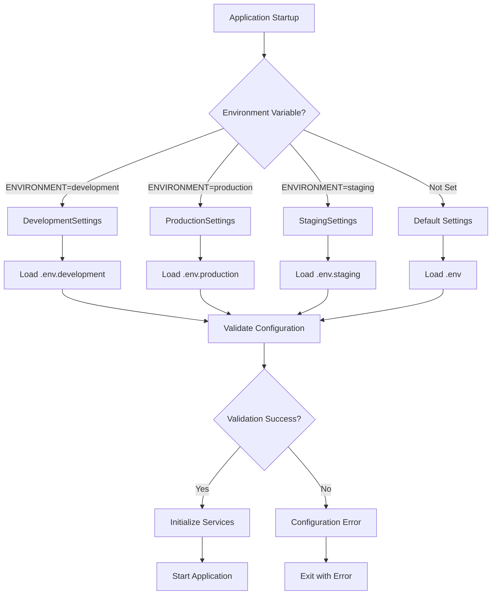

### Environment Configuration Files

#### `.env.example`
```bash
# Application Settings
ENVIRONMENT=development
DEBUG=true
APP_NAME="AI Agent Application"
HOST=0.0.0.0
PORT=8000

# Database Settings (PostgreSQL)
DB_HOST=localhost
DB_PORT=5432
DB_NAME=ai_agent
DB_USER=postgres
DB_PASSWORD=password
DB_MIN_POOL_SIZE=5
DB_MAX_POOL_SIZE=20

# Redis Settings
REDIS_HOST=localhost
REDIS_PORT=6379
REDIS_DB=0
REDIS_PASSWORD=
REDIS_MAX_CONNECTIONS=20

# Security Settings
SECURITY_SECRET_KEY=your-32-character-secret-key-here
SECURITY_ACCESS_TOKEN_EXPIRE_MINUTES=30
SECURITY_CORS_ORIGINS=["http://localhost:3000"]

# LLM Provider Settings
OPENAI_API_KEY=sk-your-openai-key
ANTHROPIC_API_KEY=sk-ant-your-anthropic-key
GOOGLE_API_KEY=your-google-api-key

# Retry Configuration
RETRY_LLM_MAX_ATTEMPTS=3
RETRY_LLM_BASE_DELAY=1.0
RETRY_DB_MAX_ATTEMPTS=5
RETRY_MCP_MAX_ATTEMPTS=3

# Circuit Breaker Configuration
CIRCUIT_LLM_FAILURE_THRESHOLD=5
CIRCUIT_DB_FAILURE_THRESHOLD=3
CIRCUIT_MCP_FAILURE_THRESHOLD=3

# Rate Limiting
RATE_LIMIT_API_DEFAULT_LIMIT=100
RATE_LIMIT_LLM_REQUESTS_PER_MINUTE=60

# Observability
OBSERVABILITY_LOG_LEVEL=INFO
OBSERVABILITY_METRICS_ENABLED=true
OBSERVABILITY_TRACING_ENABLED=true

# Feature Flags
FEATURE_ENABLE_CIRCUIT_BREAKERS=true
FEATURE_ENABLE_RETRIES=true
FEATURE_ENABLE_WEBSOCKETS=true
```

#### `.env.development`
```bash
ENVIRONMENT=development
DEBUG=true
USE_MEMORY=true
USE_DATABASE=false
USE_REDIS=false

OBSERVABILITY_LOG_LEVEL=DEBUG
OBSERVABILITY_TRACING_SAMPLE_RATE=1.0
FEATURE_ENABLE_DEBUG_ENDPOINTS=true

# Relaxed rate limits for development
RATE_LIMIT_API_DEFAULT_LIMIT=1000
RATE_LIMIT_LLM_REQUESTS_PER_MINUTE=100
```

#### `.env.production`
```bash
ENVIRONMENT=production
DEBUG=false
USE_MEMORY=false
USE_DATABASE=true
USE_REDIS=true
WORKERS=4

OBSERVABILITY_LOG_LEVEL=INFO
OBSERVABILITY_TRACING_SAMPLE_RATE=0.01
FEATURE_ENABLE_DEBUG_ENDPOINTS=false

# Production rate limits
RATE_LIMIT_API_DEFAULT_LIMIT=100
RATE_LIMIT_LLM_REQUESTS_PER_MINUTE=60

# Production circuit breakers
CIRCUIT_LLM_FAILURE_THRESHOLD=3
CIRCUIT_DB_FAILURE_THRESHOLD=2
```

### Secret Management Configuration

```python
from abc import ABC, abstractmethod
from typing import Dict, Optional
from pydantic import BaseSettings, Field


class SecretManagerSettings(BaseSettings):
    """Secret manager configuration."""
    provider: str = "local"  # local, aws, azure, gcp
    region: Optional[str] = None
    cache_ttl: int = 300  # 5 minutes
    auto_refresh: bool = True

    # AWS specific
    aws_region: str = "us-east-1"
    aws_access_key_id: Optional[str] = None
    aws_secret_access_key: Optional[str] = None

    # Azure specific
    azure_tenant_id: Optional[str] = None
    azure_client_id: Optional[str] = None
    azure_client_secret: Optional[str] = None
    azure_vault_url: Optional[str] = None

    # GCP specific
    gcp_project_id: Optional[str] = None
    gcp_credentials_path: Optional[str] = None


class SecretConfig(BaseSettings):
    """Runtime secret configuration."""
    model_config = SettingsConfigDict(
        env_prefix="SECRET_",
        env_file=".env",
        extra="ignore"
    )

    # Secret names in external providers
    openai_api_key_name: str = "openai-api-key"
    anthropic_api_key_name: str = "anthropic-api-key"
    google_api_key_name: str = "google-api-key"
    database_password_name: str = "database-password"
    redis_password_name: str = "redis-password"
    jwt_secret_name: str = "jwt-secret-key"

    # Local fallback values (for development)
    openai_api_key: Optional[str] = None
    anthropic_api_key: Optional[str] = None
    google_api_key: Optional[str] = None
    database_password: Optional[str] = None
    redis_password: Optional[str] = None
    jwt_secret: Optional[str] = None
```

### Configuration Factory Pattern

```python
def get_settings() -> ApplicationSettings:
    """Get application settings based on environment."""
    environment = os.getenv("ENVIRONMENT", "development").lower()

    if environment == "development":
        return DevelopmentSettings()
    elif environment == "production":
        return ProductionSettings()
    elif environment == "staging":
        return StagingSettings()
    elif environment == "testing":
        return TestingSettings()
    else:
        return ApplicationSettings()


# Global settings instance
settings = get_settings()
```

### Configuration Validation

```python
from typing import List
from pydantic import ValidationError


class ConfigurationValidator:
    """Validates application configuration."""

    @staticmethod
    def validate_settings(settings: ApplicationSettings) -> List[str]:
        """Validate settings and return list of errors."""
        errors = []

        # Production-specific validations
        if settings.is_production:
            if settings.debug:
                errors.append("Debug mode should be disabled in production")

            if settings.security.secret_key == "dev-secret-key-change-in-production-32chars":
                errors.append("Production secret key must be changed from default")

            if not settings.use_database and not settings.use_redis:
                errors.append("Production should use persistent storage")

        # Database validation
        if settings.use_database:
            try:
                # Test database connection string format
                settings.database.url
            except Exception as e:
                errors.append(f"Invalid database configuration: {e}")

        # Redis validation
        if settings.use_redis:
            try:
                # Test Redis connection string format
                settings.redis.url
            except Exception as e:
                errors.append(f"Invalid Redis configuration: {e}")

        return errors

    @staticmethod
    def validate_or_exit(settings: ApplicationSettings) -> None:
        """Validate settings or exit with error."""
        errors = ConfigurationValidator.validate_settings(settings)
        if errors:
            print("Configuration validation failed:")
            for error in errors:
                print(f"  - {error}")
            sys.exit(1)
```


## 5. Infrastructure Strategy

### Persistence Layer Decision Matrix

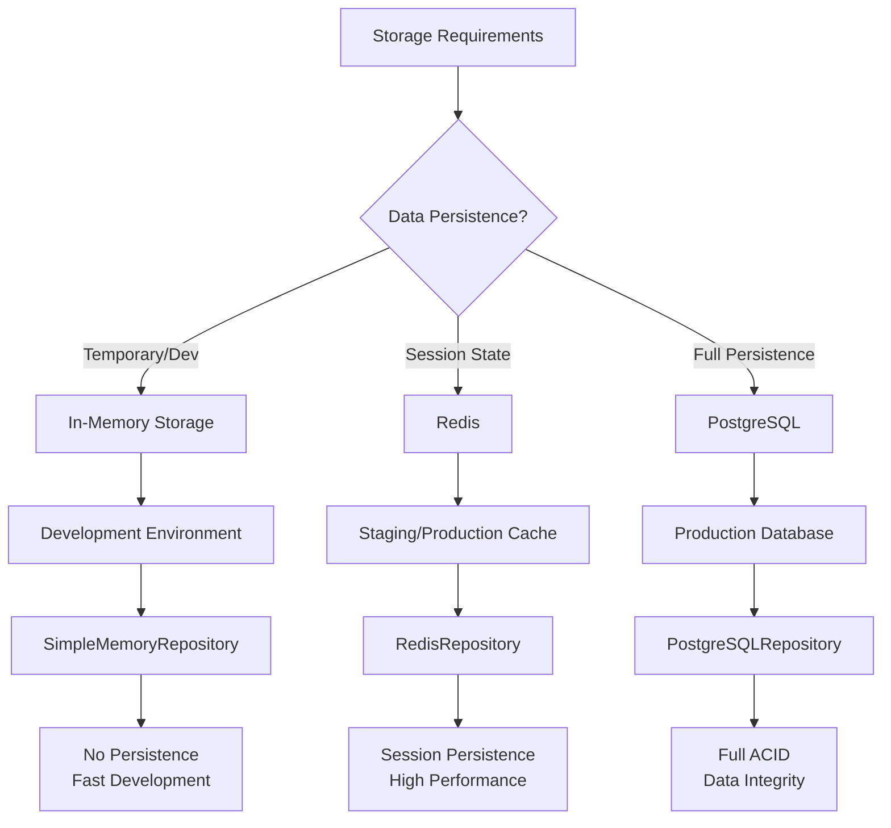

### Storage Implementations

#### Memory Storage (Development)

```python
from typing import Dict, List, Optional, Any
from uuid import UUID
import asyncio
from collections import defaultdict
from datetime import datetime, timezone

from ai_agent.domain.models import Session, Message, Agent, Tool, MCPServer


class InMemoryRepository:
    """In-memory storage for development and testing."""

    def __init__(self):
        # Storage dictionaries
        self._sessions: Dict[UUID, Session] = {}
        self._messages: Dict[UUID, Message] = {}
        self._agents: Dict[UUID, Agent] = {}
        self._tools: Dict[UUID, Tool] = {}
        self._mcp_servers: Dict[UUID, MCPServer] = {}

        # Indexes for efficient queries
        self._messages_by_session: Dict[UUID, List[UUID]] = defaultdict(list)
        self._tools_by_agent: Dict[UUID, List[UUID]] = defaultdict(list)

        # Thread safety
        self._lock = asyncio.Lock()

    async def create_session(self, session: Session) -> Session:
        """Create a new session."""
        async with self._lock:
            self._sessions[session.id] = session
            return session

    async def get_session(self, session_id: UUID) -> Optional[Session]:
        """Get session by ID."""
        return self._sessions.get(session_id)

    async def list_sessions(
        self,
        user_id: Optional[str] = None,
        limit: int = 100,
        offset: int = 0
    ) -> List[Session]:
        """List sessions with optional filtering."""
        sessions = list(self._sessions.values())

        if user_id:
            sessions = [s for s in sessions if s.user_id == user_id]

        # Sort by last activity
        sessions.sort(key=lambda s: s.last_activity, reverse=True)

        return sessions[offset:offset + limit]

    async def create_message(self, message: Message) -> Message:
        """Create a new message."""
        async with self._lock:
            self._messages[message.id] = message
            self._messages_by_session[message.session_id].append(message.id)

            # Update session message count and last activity
            if session := self._sessions.get(message.session_id):
                session.message_count += 1
                session.last_activity = datetime.now(timezone.utc)

            return message

    async def get_messages_by_session(
        self,
        session_id: UUID,
        limit: int = 100,
        offset: int = 0
    ) -> List[Message]:
        """Get messages for a session."""
        message_ids = self._messages_by_session.get(session_id, [])
        messages = [self._messages[mid] for mid in message_ids if mid in self._messages]

        # Sort by creation time
        messages.sort(key=lambda m: m.created_at)

        return messages[offset:offset + limit]
```

#### Redis Storage (Production Cache)

```python
import json
import redis.asyncio as redis
from typing import Dict, List, Optional, Any
from uuid import UUID
from datetime import datetime, timedelta

from ai_agent.domain.models import Session, Message, Agent
from ai_agent.config.settings import RedisSettings


class RedisRepository:
    """Redis-based storage for session state and caching."""

    def __init__(self, settings: RedisSettings):
        self.settings = settings
        self._redis: Optional[redis.Redis] = None

        # Key prefixes
        self.SESSION_PREFIX = "session:"
        self.MESSAGE_PREFIX = "message:"
        self.SESSION_MESSAGES_PREFIX = "session_messages:"
        self.USER_SESSIONS_PREFIX = "user_sessions:"

        # Default TTL (1 hour)
        self.DEFAULT_TTL = 3600

    async def connect(self):
        """Initialize Redis connection."""
        self._redis = redis.from_url(
            self.settings.url,
            max_connections=self.settings.max_connections,
            retry_on_timeout=self.settings.retry_on_timeout,
            health_check_interval=self.settings.health_check_interval
        )

        # Test connection
        await self._redis.ping()

    async def disconnect(self):
        """Close Redis connection."""
        if self._redis:
            await self._redis.close()

    async def create_session(self, session: Session) -> Session:
        """Create a new session in Redis."""
        session_key = f"{self.SESSION_PREFIX}{session.id}"
        user_sessions_key = f"{self.USER_SESSIONS_PREFIX}{session.user_id}"

        # Store session data
        session_data = session.model_dump_json()
        await self._redis.setex(session_key, self.DEFAULT_TTL, session_data)

        # Add to user's session list
        if session.user_id:
            await self._redis.zadd(
                user_sessions_key,
                {str(session.id): session.created_at.timestamp()}
            )
            await self._redis.expire(user_sessions_key, self.DEFAULT_TTL)

        return session

    async def get_session(self, session_id: UUID) -> Optional[Session]:
        """Get session from Redis."""
        session_key = f"{self.SESSION_PREFIX}{session_id}"
        session_data = await self._redis.get(session_key)

        if session_data:
            data = json.loads(session_data)
            return Session.model_validate(data)

        return None

    async def create_message(self, message: Message) -> Message:
        """Create a new message in Redis."""
        message_key = f"{self.MESSAGE_PREFIX}{message.id}"
        session_messages_key = f"{self.SESSION_MESSAGES_PREFIX}{message.session_id}"

        # Store message data
        message_data = message.model_dump_json()
        await self._redis.setex(message_key, self.DEFAULT_TTL, message_data)

        # Add to session's message list (sorted by timestamp)
        await self._redis.zadd(
            session_messages_key,
            {str(message.id): message.created_at.timestamp()}
        )
        await self._redis.expire(session_messages_key, self.DEFAULT_TTL)

        # Update session metadata
        await self._update_session_activity(message.session_id)

        return message

    async def _update_session_activity(self, session_id: UUID):
        """Update session's last activity and message count."""
        session_key = f"{self.SESSION_PREFIX}{session_id}"

        # Get current session
        session_data = await self._redis.get(session_key)
        if session_data:
            session_dict = json.loads(session_data)
            session_dict['last_activity'] = datetime.now(timezone.utc).isoformat()
            session_dict['message_count'] = session_dict.get('message_count', 0) + 1

            # Update session
            await self._redis.setex(session_key, self.DEFAULT_TTL, json.dumps(session_dict))
```

#### PostgreSQL Storage (Production Database)

```python
import asyncpg
from typing import Dict, List, Optional, Any
from uuid import UUID
from datetime import datetime
from contextlib import asynccontextmanager

from ai_agent.domain.models import Session, Message, Agent, Tool, MCPServer
from ai_agent.config.settings import DatabaseSettings


class PostgreSQLRepository:
    """PostgreSQL-based storage for full persistence."""

    def __init__(self, settings: DatabaseSettings):
        self.settings = settings
        self._pool: Optional[asyncpg.Pool] = None

    async def connect(self):
        """Initialize database connection pool."""
        self._pool = await asyncpg.create_pool(
            host=self.settings.host,
            port=self.settings.port,
            database=self.settings.name,
            user=self.settings.user,
            password=self.settings.password,
            min_size=self.settings.min_pool_size,
            max_size=self.settings.max_pool_size,
            command_timeout=self.settings.pool_timeout
        )

    async def disconnect(self):
        """Close database connection pool."""
        if self._pool:
            await self._pool.close()

    @asynccontextmanager
    async def get_connection(self):
        """Get database connection from pool."""
        async with self._pool.acquire() as connection:
            yield connection

    async def create_session(self, session: Session) -> Session:
        """Create a new session in PostgreSQL."""
        async with self.get_connection() as conn:
            await conn.execute("""
                INSERT INTO sessions (
                    id, user_id, title, metadata, message_count,
                    last_activity, created_at, updated_at
                ) VALUES ($1, $2, $3, $4, $5, $6, $7, $8)
            """,
                session.id,
                session.user_id,
                session.title,
                session.metadata,
                session.message_count,
                session.last_activity,
                session.created_at,
                session.updated_at
            )

        return session

    async def get_session(self, session_id: UUID) -> Optional[Session]:
        """Get session from PostgreSQL."""
        async with self.get_connection() as conn:
            row = await conn.fetchrow(
                "SELECT * FROM sessions WHERE id = $1",
                session_id
            )

            if row:
                return Session(
                    id=row['id'],
                    user_id=row['user_id'],
                    title=row['title'],
                    metadata=row['metadata'],
                    message_count=row['message_count'],
                    last_activity=row['last_activity'],
                    created_at=row['created_at'],
                    updated_at=row['updated_at']
                )

        return None

    async def list_sessions(
        self,
        user_id: Optional[str] = None,
        limit: int = 100,
        offset: int = 0
    ) -> List[Session]:
        """List sessions with optional filtering."""
        async with self.get_connection() as conn:
            if user_id:
                rows = await conn.fetch("""
                    SELECT * FROM sessions
                    WHERE user_id = $1
                    ORDER BY last_activity DESC
                    LIMIT $2 OFFSET $3
                """, user_id, limit, offset)
            else:
                rows = await conn.fetch("""
                    SELECT * FROM sessions
                    ORDER BY last_activity DESC
                    LIMIT $1 OFFSET $2
                """, limit, offset)

            return [
                Session(
                    id=row['id'],
                    user_id=row['user_id'],
                    title=row['title'],
                    metadata=row['metadata'],
                    message_count=row['message_count'],
                    last_activity=row['last_activity'],
                    created_at=row['created_at'],
                    updated_at=row['updated_at']
                )
                for row in rows
            ]

    async def create_message(self, message: Message) -> Message:
        """Create a new message in PostgreSQL."""
        async with self.get_connection() as conn:
            async with conn.transaction():
                # Insert message
                await conn.execute("""
                    INSERT INTO messages (
                        id, session_id, role, content, metadata,
                        tool_calls, parent_message_id, created_at, updated_at
                    ) VALUES ($1, $2, $3, $4, $5, $6, $7, $8, $9)
                """,
                    message.id,
                    message.session_id,
                    message.role.value,
                    message.content,
                    message.metadata,
                    message.tool_calls,
                    message.parent_message_id,
                    message.created_at,
                    message.updated_at
                )

                # Update session message count and last activity
                await conn.execute("""
                    UPDATE sessions
                    SET message_count = message_count + 1,
                        last_activity = $2,
                        updated_at = $2
                    WHERE id = $1
                """, message.session_id, datetime.now(timezone.utc))

        return message
```

### Repository Factory Pattern

```python
from abc import ABC, abstractmethod
from typing import Protocol

from ai_agent.config.settings import ApplicationSettings


class Repository(Protocol):
    """Repository interface."""

    async def connect(self) -> None: ...
    async def disconnect(self) -> None: ...
    async def create_session(self, session: Session) -> Session: ...
    async def get_session(self, session_id: UUID) -> Optional[Session]: ...
    async def create_message(self, message: Message) -> Message: ...


class RepositoryFactory:
    """Factory for creating repository instances."""

    @staticmethod
    def create_repository(settings: ApplicationSettings) -> Repository:
        """Create repository based on configuration."""
        if settings.use_database:
            return PostgreSQLRepository(settings.database)
        elif settings.use_redis:
            return RedisRepository(settings.redis)
        else:
            return InMemoryRepository()


# Dependency injection
async def get_repository() -> Repository:
    """Get repository instance for dependency injection."""
    repository = RepositoryFactory.create_repository(settings)
    await repository.connect()
    return repository
```

### Database Schema (PostgreSQL)

```sql
-- Extensions
CREATE EXTENSION IF NOT EXISTS "uuid-ossp";
CREATE EXTENSION IF NOT EXISTS "pg_trgm";

-- Sessions table
CREATE TABLE IF NOT EXISTS sessions (
    id UUID PRIMARY KEY DEFAULT uuid_generate_v4(),
    user_id VARCHAR(255),
    title VARCHAR(500),
    metadata JSONB DEFAULT '{}',
    message_count INTEGER DEFAULT 0,
    last_activity TIMESTAMP WITH TIME ZONE DEFAULT CURRENT_TIMESTAMP,
    created_at TIMESTAMP WITH TIME ZONE DEFAULT CURRENT_TIMESTAMP,
    updated_at TIMESTAMP WITH TIME ZONE DEFAULT CURRENT_TIMESTAMP
);

-- Messages table
CREATE TABLE IF NOT EXISTS messages (
    id UUID PRIMARY KEY DEFAULT uuid_generate_v4(),
    session_id UUID NOT NULL REFERENCES sessions(id) ON DELETE CASCADE,
    role VARCHAR(50) NOT NULL,
    content TEXT NOT NULL,
    metadata JSONB DEFAULT '{}',
    tool_calls JSONB DEFAULT '[]',
    parent_message_id UUID REFERENCES messages(id),
    created_at TIMESTAMP WITH TIME ZONE DEFAULT CURRENT_TIMESTAMP,
    updated_at TIMESTAMP WITH TIME ZONE DEFAULT CURRENT_TIMESTAMP
);

-- Agents table
CREATE TABLE IF NOT EXISTS agents (
    id UUID PRIMARY KEY DEFAULT uuid_generate_v4(),
    name VARCHAR(255) NOT NULL UNIQUE,
    description TEXT,
    system_prompt TEXT,
    model_config JSONB DEFAULT '{}',
    tools TEXT[] DEFAULT '{}',
    status VARCHAR(50) DEFAULT 'idle',
    metadata JSONB DEFAULT '{}',
    created_at TIMESTAMP WITH TIME ZONE DEFAULT CURRENT_TIMESTAMP,
    updated_at TIMESTAMP WITH TIME ZONE DEFAULT CURRENT_TIMESTAMP
);

-- Tools table
CREATE TABLE IF NOT EXISTS tools (
    id UUID PRIMARY KEY DEFAULT uuid_generate_v4(),
    name VARCHAR(255) NOT NULL UNIQUE,
    description TEXT NOT NULL,
    schema JSONB NOT NULL,
    mcp_server_id UUID REFERENCES mcp_servers(id),
    enabled BOOLEAN DEFAULT true,
    metadata JSONB DEFAULT '{}',
    created_at TIMESTAMP WITH TIME ZONE DEFAULT CURRENT_TIMESTAMP,
    updated_at TIMESTAMP WITH TIME ZONE DEFAULT CURRENT_TIMESTAMP
);

-- MCP Servers table
CREATE TABLE IF NOT EXISTS mcp_servers (
    id UUID PRIMARY KEY DEFAULT uuid_generate_v4(),
    name VARCHAR(255) NOT NULL UNIQUE,
    description TEXT,
    endpoint VARCHAR(500) NOT NULL,
    authentication JSONB DEFAULT '{}',
    capabilities TEXT[] DEFAULT '{}',
    health_check_url VARCHAR(500),
    enabled BOOLEAN DEFAULT true,
    created_at TIMESTAMP WITH TIME ZONE DEFAULT CURRENT_TIMESTAMP,
    updated_at TIMESTAMP WITH TIME ZONE DEFAULT CURRENT_TIMESTAMP
);

-- External Services table
CREATE TABLE IF NOT EXISTS external_services (
    id UUID PRIMARY KEY DEFAULT uuid_generate_v4(),
    name VARCHAR(255) NOT NULL UNIQUE,
    service_type VARCHAR(100) NOT NULL,
    endpoint VARCHAR(500) NOT NULL,
    authentication JSONB DEFAULT '{}',
    retry_config JSONB DEFAULT '{}',
    circuit_breaker_config JSONB DEFAULT '{}',
    health_check_url VARCHAR(500),
    enabled BOOLEAN DEFAULT true,
    created_at TIMESTAMP WITH TIME ZONE DEFAULT CURRENT_TIMESTAMP,
    updated_at TIMESTAMP WITH TIME ZONE DEFAULT CURRENT_TIMESTAMP
);

-- Indexes for performance
CREATE INDEX IF NOT EXISTS idx_sessions_user_id ON sessions(user_id);
CREATE INDEX IF NOT EXISTS idx_sessions_last_activity ON sessions(last_activity DESC);
CREATE INDEX IF NOT EXISTS idx_messages_session_id ON messages(session_id);
CREATE INDEX IF NOT EXISTS idx_messages_created_at ON messages(created_at);
CREATE INDEX IF NOT EXISTS idx_agents_status ON agents(status);
CREATE INDEX IF NOT EXISTS idx_tools_enabled ON tools(enabled);
CREATE INDEX IF NOT EXISTS idx_mcp_servers_enabled ON mcp_servers(enabled);

-- Full-text search indexes
CREATE INDEX IF NOT EXISTS idx_sessions_title_gin ON sessions USING gin(title gin_trgm_ops);
CREATE INDEX IF NOT EXISTS idx_messages_content_gin ON messages USING gin(content gin_trgm_ops);

-- Triggers for updated_at
CREATE OR REPLACE FUNCTION update_updated_at_column()
RETURNS TRIGGER AS $$
BEGIN
    NEW.updated_at = CURRENT_TIMESTAMP;
    RETURN NEW;
END;
$$ language 'plpgsql';

CREATE TRIGGER update_sessions_updated_at BEFORE UPDATE ON sessions
    FOR EACH ROW EXECUTE FUNCTION update_updated_at_column();

CREATE TRIGGER update_messages_updated_at BEFORE UPDATE ON messages
    FOR EACH ROW EXECUTE FUNCTION update_updated_at_column();

CREATE TRIGGER update_agents_updated_at BEFORE UPDATE ON agents
    FOR EACH ROW EXECUTE FUNCTION update_updated_at_column();

CREATE TRIGGER update_tools_updated_at BEFORE UPDATE ON tools
    FOR EACH ROW EXECUTE FUNCTION update_updated_at_column();

CREATE TRIGGER update_mcp_servers_updated_at BEFORE UPDATE ON mcp_servers
    FOR EACH ROW EXECUTE FUNCTION update_updated_at_column();
```

### Deployment Architecture

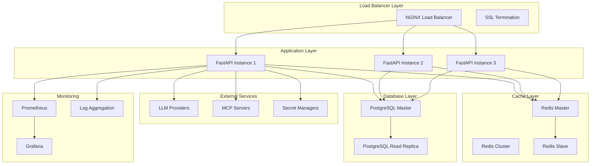


## 6. Comprehensive REST API Specification

### API Design Principles

1. **RESTful Design**: Follow REST principles with clear resource-based URLs
2. **Consistent Patterns**: Uniform response formats and error handling
3. **API Versioning**: Version via URL path (/api/v1/)
4. **Pagination**: Cursor-based pagination for large datasets
5. **Filtering & Sorting**: Query parameter-based filtering and sorting
6. **Bulk Operations**: Support for efficient batch operations
7. **Rate Limiting**: Per-endpoint and per-user rate limiting

### API Structure Overview

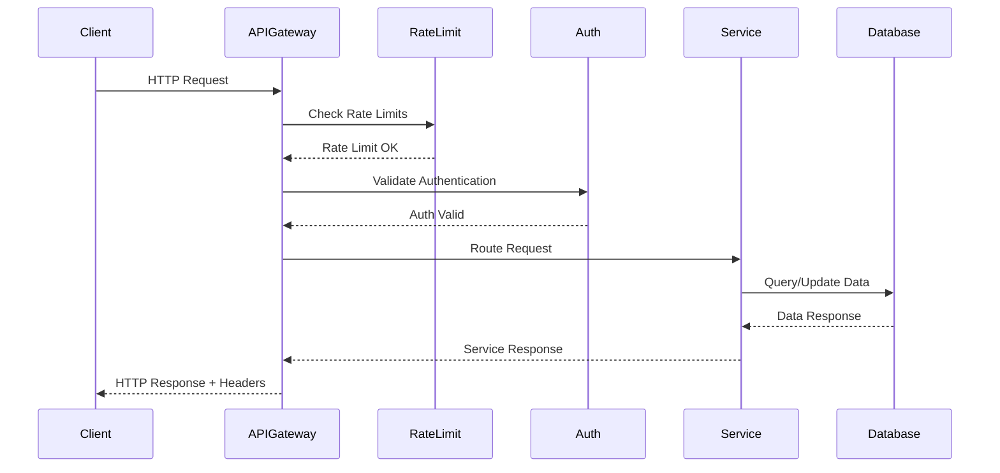

### Core API Endpoints

#### Sessions API

```python
from fastapi import APIRouter, Depends, HTTPException, Query
from typing import List, Optional
from uuid import UUID

from ai_agent.domain.models import Session, CreateSessionRequest
from ai_agent.core.sessions.service import SessionService
from ai_agent.api.dependencies import get_session_service, get_current_user

router = APIRouter(prefix="/api/v1/sessions", tags=["sessions"])


@router.post("/", response_model=Session, status_code=201)
async def create_session(
    request: CreateSessionRequest,
    session_service: SessionService = Depends(get_session_service),
    current_user: str = Depends(get_current_user)
) -> Session:
    """
    Create a new conversation session.

    - **user_id**: Optional user identifier
    - **title**: Optional session title
    - **metadata**: Additional session metadata
    """
    return await session_service.create_session(request, current_user)


@router.get("/", response_model=List[Session])
async def list_sessions(
    user_id: Optional[str] = Query(None, description="Filter by user ID"),
    limit: int = Query(20, ge=1, le=100, description="Number of sessions to return"),
    offset: int = Query(0, ge=0, description="Number of sessions to skip"),
    sort_by: str = Query("last_activity", regex="^(created_at|updated_at|last_activity)$"),
    sort_order: str = Query("desc", regex="^(asc|desc)$"),
    session_service: SessionService = Depends(get_session_service),
    current_user: str = Depends(get_current_user)
) -> List[Session]:
    """
    List conversation sessions with filtering and pagination.

    - **user_id**: Filter sessions by user
    - **limit**: Maximum number of sessions to return (1-100)
    - **offset**: Number of sessions to skip for pagination
    - **sort_by**: Field to sort by (created_at, updated_at, last_activity)
    - **sort_order**: Sort order (asc, desc)
    """
    return await session_service.list_sessions(
        user_id=user_id,
        limit=limit,
        offset=offset,
        sort_by=sort_by,
        sort_order=sort_order,
        current_user=current_user
    )


@router.get("/{session_id}", response_model=Session)
async def get_session(
    session_id: UUID,
    session_service: SessionService = Depends(get_session_service),
    current_user: str = Depends(get_current_user)
) -> Session:
    """Get a specific session by ID."""
    session = await session_service.get_session(session_id, current_user)
    if not session:
        raise HTTPException(status_code=404, detail="Session not found")
    return session


@router.put("/{session_id}", response_model=Session)
async def update_session(
    session_id: UUID,
    request: CreateSessionRequest,
    session_service: SessionService = Depends(get_session_service),
    current_user: str = Depends(get_current_user)
) -> Session:
    """Update session metadata."""
    return await session_service.update_session(session_id, request, current_user)


@router.delete("/{session_id}", status_code=204)
async def delete_session(
    session_id: UUID,
    session_service: SessionService = Depends(get_session_service),
    current_user: str = Depends(get_current_user)
):
    """Delete a session and all its messages."""
    await session_service.delete_session(session_id, current_user)


@router.post("/bulk-create", response_model=List[Session], status_code=201)
async def bulk_create_sessions(
    requests: List[CreateSessionRequest],
    session_service: SessionService = Depends(get_session_service),
    current_user: str = Depends(get_current_user)
) -> List[Session]:
    """Create multiple sessions in batch."""
    return await session_service.bulk_create_sessions(requests, current_user)


@router.delete("/bulk-delete", status_code=204)
async def bulk_delete_sessions(
    session_ids: List[UUID],
    session_service: SessionService = Depends(get_session_service),
    current_user: str = Depends(get_current_user)
):
    """Delete multiple sessions in batch."""
    await session_service.bulk_delete_sessions(session_ids, current_user)
```

#### Messages API

```python
@router.post("/sessions/{session_id}/messages", response_model=Message, status_code=201)
async def create_message(
    session_id: UUID,
    request: CreateMessageRequest,
    message_service: MessageService = Depends(get_message_service),
    current_user: str = Depends(get_current_user)
) -> Message:
    """Create a new message in a session."""
    return await message_service.create_message(session_id, request, current_user)


@router.get("/sessions/{session_id}/messages", response_model=List[Message])
async def list_messages(
    session_id: UUID,
    limit: int = Query(50, ge=1, le=200),
    offset: int = Query(0, ge=0),
    role: Optional[MessageRole] = Query(None, description="Filter by message role"),
    search: Optional[str] = Query(None, description="Search in message content"),
    message_service: MessageService = Depends(get_message_service),
    current_user: str = Depends(get_current_user)
) -> List[Message]:
    """List messages in a session with filtering."""
    return await message_service.list_messages(
        session_id=session_id,
        limit=limit,
        offset=offset,
        role=role,
        search=search,
        current_user=current_user
    )


@router.get("/messages/{message_id}", response_model=Message)
async def get_message(
    message_id: UUID,
    message_service: MessageService = Depends(get_message_service),
    current_user: str = Depends(get_current_user)
) -> Message:
    """Get a specific message by ID."""
    message = await message_service.get_message(message_id, current_user)
    if not message:
        raise HTTPException(status_code=404, detail="Message not found")
    return message


@router.put("/messages/{message_id}", response_model=Message)
async def update_message(
    message_id: UUID,
    request: CreateMessageRequest,
    message_service: MessageService = Depends(get_message_service),
    current_user: str = Depends(get_current_user)
) -> Message:
    """Update message content and metadata."""
    return await message_service.update_message(message_id, request, current_user)


@router.delete("/messages/{message_id}", status_code=204)
async def delete_message(
    message_id: UUID,
    message_service: MessageService = Depends(get_message_service),
    current_user: str = Depends(get_current_user)
):
    """Delete a specific message."""
    await message_service.delete_message(message_id, current_user)
```

#### Agents API

```python
@router.post("/agents", response_model=Agent, status_code=201)
async def create_agent(
    request: CreateAgentRequest,
    agent_service: AgentService = Depends(get_agent_service),
    current_user: str = Depends(get_current_user)
) -> Agent:
    """Create a new AI agent."""
    return await agent_service.create_agent(request, current_user)


@router.get("/agents", response_model=List[Agent])
async def list_agents(
    status: Optional[AgentStatus] = Query(None, description="Filter by agent status"),
    search: Optional[str] = Query(None, description="Search in agent name/description"),
    limit: int = Query(20, ge=1, le=100),
    offset: int = Query(0, ge=0),
    agent_service: AgentService = Depends(get_agent_service),
    current_user: str = Depends(get_current_user)
) -> List[Agent]:
    """List AI agents with filtering."""
    return await agent_service.list_agents(
        status=status,
        search=search,
        limit=limit,
        offset=offset,
        current_user=current_user
    )


@router.get("/agents/{agent_id}", response_model=Agent)
async def get_agent(
    agent_id: UUID,
    agent_service: AgentService = Depends(get_agent_service),
    current_user: str = Depends(get_current_user)
) -> Agent:
    """Get specific agent by ID."""
    agent = await agent_service.get_agent(agent_id, current_user)
    if not agent:
        raise HTTPException(status_code=404, detail="Agent not found")
    return agent


@router.put("/agents/{agent_id}", response_model=Agent)
async def update_agent(
    agent_id: UUID,
    request: CreateAgentRequest,
    agent_service: AgentService = Depends(get_agent_service),
    current_user: str = Depends(get_current_user)
) -> Agent:
    """Update agent configuration."""
    return await agent_service.update_agent(agent_id, request, current_user)


@router.delete("/agents/{agent_id}", status_code=204)
async def delete_agent(
    agent_id: UUID,
    agent_service: AgentService = Depends(get_agent_service),
    current_user: str = Depends(get_current_user)
):
    """Delete an agent."""
    await agent_service.delete_agent(agent_id, current_user)


@router.post("/agents/{agent_id}/execute", response_model=AgentExecutionResponse)
async def execute_agent(
    agent_id: UUID,
    request: AgentExecutionRequest,
    agent_service: AgentService = Depends(get_agent_service),
    current_user: str = Depends(get_current_user)
) -> AgentExecutionResponse:
    """Execute agent with a message."""
    return await agent_service.execute_agent(agent_id, request, current_user)


@router.post("/agents/{agent_id}/execute/stream")
async def execute_agent_stream(
    agent_id: UUID,
    request: AgentExecutionRequest,
    agent_service: AgentService = Depends(get_agent_service),
    current_user: str = Depends(get_current_user)
):
    """Execute agent with streaming response."""
    return StreamingResponse(
        agent_service.execute_agent_stream(agent_id, request, current_user),
        media_type="text/event-stream"
    )
```

### Error Response Standardization

```python
from pydantic import BaseModel
from typing import Optional, List, Any, Dict


class ErrorResponse(BaseModel):
    """Standardized error response format."""
    error: bool = True
    code: str
    message: str
    details: Optional[Dict[str, Any]] = None
    correlation_id: Optional[str] = None
    timestamp: str
    path: str


class ValidationErrorDetail(BaseModel):
    """Validation error detail."""
    field: str
    message: str
    value: Any


class ValidationErrorResponse(ErrorResponse):
    """Validation error response."""
    code: str = "validation_error"
    validation_errors: List[ValidationErrorDetail]


# Global exception handlers
@app.exception_handler(ValidationException)
async def validation_exception_handler(request: Request, exc: ValidationException):
    return JSONResponse(
        status_code=422,
        content=ValidationErrorResponse(
            message="Validation failed",
            validation_errors=[
                ValidationErrorDetail(
                    field=exc.details.get("field", "unknown"),
                    message=str(exc),
                    value=exc.details.get("value")
                )
            ],
            correlation_id=getattr(request.state, "correlation_id", None),
            timestamp=datetime.now(timezone.utc).isoformat(),
            path=str(request.url.path)
        ).model_dump()
    )


@app.exception_handler(ExternalServiceException)
async def external_service_exception_handler(request: Request, exc: ExternalServiceException):
    status_code = 503 if exc.is_retryable else 502

    return JSONResponse(
        status_code=status_code,
        content=ErrorResponse(
            code="external_service_error",
            message=str(exc),
            details=exc.details,
            correlation_id=getattr(request.state, "correlation_id", None),
            timestamp=datetime.now(timezone.utc).isoformat(),
            path=str(request.url.path)
        ).model_dump()
    )
```

### OpenAPI Configuration

```python
from fastapi.openapi.utils import get_openapi


def custom_openapi():
    if app.openapi_schema:
        return app.openapi_schema

    openapi_schema = get_openapi(
        title="AI Agent API",
        version="1.0.0",
        description="""
        ## Production-ready AI Agent Application API

        This API provides comprehensive endpoints for managing AI agents, sessions,
        messages, and tools with built-in resilience patterns.

        ### Features
        - **Session Management**: Create and manage conversation sessions
        - **Message Handling**: CRUD operations for messages with full-text search
        - **Agent Execution**: Execute AI agents with streaming support
        - **Tool Integration**: Manage MCP server tools and capabilities
        - **Real-time**: WebSocket support for live updates
        - **Resilience**: Built-in retry logic and circuit breakers

        ### Authentication
        Use API keys in the `Authorization` header: `Bearer <your-api-key>`

        ### Rate Limiting
        - Default: 100 requests/minute
        - Authenticated: 1000 requests/minute
        - Premium: 5000 requests/minute

        ### Error Handling
        All errors follow standardized format with correlation IDs for tracing.
        """,
        routes=app.routes,
    )

    # Add security schemes
    openapi_schema["components"]["securitySchemes"] = {
        "ApiKeyAuth": {
            "type": "apiKey",
            "in": "header",
            "name": "Authorization",
            "description": "Enter your API key as 'Bearer <api-key>'"
        },
        "JWTAuth": {
            "type": "http",
            "scheme": "bearer",
            "bearerFormat": "JWT",
            "description": "JWT token for authenticated users"
        }
    }

    # Add global security requirement
    openapi_schema["security"] = [
        {"ApiKeyAuth": []},
        {"JWTAuth": []}
    ]

    # Add common responses
    openapi_schema["components"]["responses"] = {
        "ValidationError": {
            "description": "Validation Error",
            "content": {
                "application/json": {
                    "schema": {"$ref": "#/components/schemas/ValidationErrorResponse"}
                }
            }
        },
        "RateLimitError": {
            "description": "Rate Limit Exceeded",
            "content": {
                "application/json": {
                    "schema": {"$ref": "#/components/schemas/ErrorResponse"}
                }
            }
        },
        "UnauthorizedError": {
            "description": "Authentication Required",
            "content": {
                "application/json": {
                    "schema": {"$ref": "#/components/schemas/ErrorResponse"}
                }
            }
        }
    }

    app.openapi_schema = openapi_schema
    return app.openapi_schema


app.openapi = custom_openapi
```

### API Rate Limiting Implementation

```python
from slowapi import Limiter, _rate_limit_exceeded_handler
from slowapi.util import get_remote_address
from slowapi.errors import RateLimitExceeded

# Initialize rate limiter
limiter = Limiter(key_func=get_remote_address)
app.state.limiter = limiter
app.add_exception_handler(RateLimitExceeded, _rate_limit_exceeded_handler)

# Apply rate limits to endpoints
@router.post("/sessions/")
@limiter.limit("10/minute")  # Stricter limit for creation
async def create_session(request: Request, ...):
    ...

@router.get("/sessions/")
@limiter.limit("100/minute")  # More generous for reads
async def list_sessions(request: Request, ...):
    ...

@router.post("/agents/{agent_id}/execute")
@limiter.limit("5/minute")  # Very strict for expensive operations
async def execute_agent(request: Request, ...):
    ...
```


## 7. Resilience Architecture

### Circuit Breaker State Management

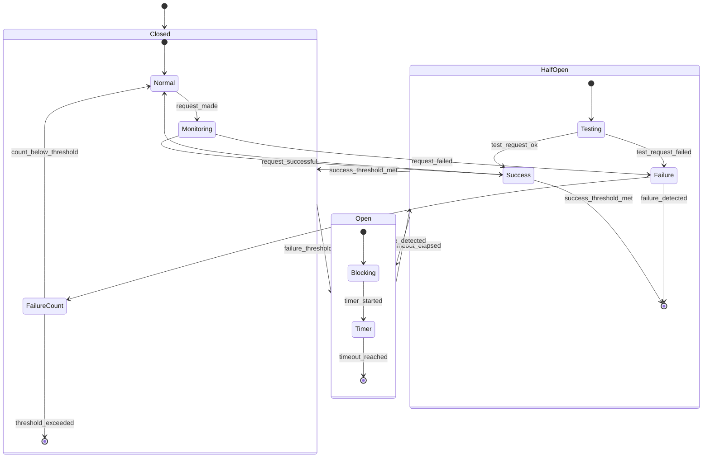

### Retry Strategy Implementation

```python
import asyncio
import random
from typing import Any, Callable, Optional, Type, Union
from tenacity import (
    retry,
    stop_after_attempt,
    wait_exponential_jitter,
    retry_if_exception_type,
    before_sleep_log,
    after_log
)
import structlog

from ai_agent.domain.exceptions import ExternalServiceException
from ai_agent.config.settings import RetrySettings

logger = structlog.get_logger()


class RetryManager:
    """Centralized retry management for external services."""

    def __init__(self, settings: RetrySettings):
        self.settings = settings

    def get_llm_retry_decorator(self):
        """Get retry decorator for LLM API calls."""
        return retry(
            stop=stop_after_attempt(self.settings.llm_max_attempts),
            wait=wait_exponential_jitter(
                initial=self.settings.llm_base_delay,
                max=self.settings.llm_max_delay,
                multiplier=self.settings.llm_multiplier,
                jitter=2.0
            ),
            retry=retry_if_exception_type((
                ExternalServiceException,
                asyncio.TimeoutError,
                ConnectionError
            )),
            before_sleep=before_sleep_log(logger, "warning"),
            after=after_log(logger, "info")
        )

    def get_database_retry_decorator(self):
        """Get retry decorator for database operations."""
        return retry(
            stop=stop_after_attempt(self.settings.db_max_attempts),
            wait=wait_exponential_jitter(
                initial=self.settings.db_base_delay,
                max=self.settings.db_max_delay,
                multiplier=self.settings.db_multiplier,
                jitter=1.0
            ),
            retry=retry_if_exception_type((
                ConnectionError,
                TimeoutError,
                # Database-specific exceptions
            )),
            before_sleep=before_sleep_log(logger, "warning"),
            after=after_log(logger, "info")
        )

    def get_mcp_retry_decorator(self):
        """Get retry decorator for MCP server calls."""
        return retry(
            stop=stop_after_attempt(self.settings.mcp_max_attempts),
            wait=wait_exponential_jitter(
                initial=self.settings.mcp_base_delay,
                max=self.settings.mcp_max_delay,
                multiplier=self.settings.mcp_multiplier,
                jitter=3.0
            ),
            retry=retry_if_exception_type((
                ExternalServiceException,
                ConnectionError,
                TimeoutError
            )),
            before_sleep=before_sleep_log(logger, "warning"),
            after=after_log(logger, "info")
        )


# Usage examples
retry_manager = RetryManager(settings.retry)

@retry_manager.get_llm_retry_decorator()
async def call_llm_api(prompt: str) -> str:
    """Call LLM API with automatic retries."""
    # Implementation here
    pass

@retry_manager.get_database_retry_decorator()
async def database_operation() -> Any:
    """Database operation with automatic retries."""
    # Implementation here
    pass
```

### Circuit Breaker Implementation

```python
import asyncio
import time
from enum import Enum
from typing import Any, Callable, Optional
from dataclasses import dataclass
import structlog

from ai_agent.config.settings import CircuitBreakerSettings

logger = structlog.get_logger()


class CircuitState(Enum):
    CLOSED = "closed"
    OPEN = "open"
    HALF_OPEN = "half_open"


@dataclass
class CircuitBreakerMetrics:
    """Circuit breaker metrics."""
    failure_count: int = 0
    success_count: int = 0
    last_failure_time: Optional[float] = None
    last_success_time: Optional[float] = None
    total_requests: int = 0


class CircuitBreaker:
    """Circuit breaker implementation for external services."""

    def __init__(self, name: str, config: CircuitBreakerSettings):
        self.name = name
        self.config = config
        self.state = CircuitState.CLOSED
        self.metrics = CircuitBreakerMetrics()
        self._lock = asyncio.Lock()

    async def call(self, func: Callable, *args, **kwargs) -> Any:
        """Execute function with circuit breaker protection."""
        async with self._lock:
            await self._update_state()

            if self.state == CircuitState.OPEN:
                raise CircuitBreakerOpenException(self.name)

            self.metrics.total_requests += 1

            try:
                result = await func(*args, **kwargs)
                await self._record_success()
                return result
            except Exception as e:
                await self._record_failure()
                raise

    async def _update_state(self):
        """Update circuit breaker state based on current conditions."""
        current_time = time.time()

        if self.state == CircuitState.OPEN:
            if (current_time - self.metrics.last_failure_time) >= self.config.recovery_timeout:
                self.state = CircuitState.HALF_OPEN
                logger.info("Circuit breaker transitioning to half-open",
                          circuit_name=self.name)

        elif self.state == CircuitState.HALF_OPEN:
            # In half-open state, allow limited traffic for testing
            pass

        elif self.state == CircuitState.CLOSED:
            if self.metrics.failure_count >= self.config.failure_threshold:
                self.state = CircuitState.OPEN
                logger.warning("Circuit breaker opening",
                             circuit_name=self.name,
                             failure_count=self.metrics.failure_count)

    async def _record_success(self):
        """Record successful operation."""
        self.metrics.success_count += 1
        self.metrics.last_success_time = time.time()

        if self.state == CircuitState.HALF_OPEN:
            # Reset circuit breaker after successful half-open test
            self.metrics.failure_count = 0
            self.state = CircuitState.CLOSED
            logger.info("Circuit breaker closing after successful test",
                       circuit_name=self.name)

    async def _record_failure(self):
        """Record failed operation."""
        self.metrics.failure_count += 1
        self.metrics.last_failure_time = time.time()

        if self.state == CircuitState.HALF_OPEN:
            # Return to open state on failure during testing
            self.state = CircuitState.OPEN
            logger.warning("Circuit breaker returning to open state",
                         circuit_name=self.name)


class CircuitBreakerManager:
    """Manages multiple circuit breakers for different services."""

    def __init__(self, settings: CircuitBreakerSettings):
        self.settings = settings
        self._breakers = {}

    def get_breaker(self, service_name: str) -> CircuitBreaker:
        """Get or create circuit breaker for service."""
        if service_name not in self._breakers:
            # Get service-specific config
            if service_name == "llm":
                config = CircuitBreakerConfig(
                    failure_threshold=self.settings.llm_failure_threshold,
                    recovery_timeout=self.settings.llm_recovery_timeout,
                    expected_exception=self.settings.llm_expected_exception
                )
            elif service_name == "database":
                config = CircuitBreakerConfig(
                    failure_threshold=self.settings.db_failure_threshold,
                    recovery_timeout=self.settings.db_recovery_timeout,
                    expected_exception=self.settings.db_expected_exception
                )
            elif service_name == "mcp":
                config = CircuitBreakerConfig(
                    failure_threshold=self.settings.mcp_failure_threshold,
                    recovery_timeout=self.settings.mcp_recovery_timeout,
                    expected_exception=self.settings.mcp_expected_exception
                )
            else:
                # Default config
                config = CircuitBreakerConfig()

            self._breakers[service_name] = CircuitBreaker(service_name, config)

        return self._breakers[service_name]


# Global circuit breaker manager
circuit_breaker_manager = CircuitBreakerManager(settings.circuit_breaker)


# Decorator for circuit breaker protection
def circuit_protected(service_name: str):
    """Decorator to protect functions with circuit breaker."""
    def decorator(func):
        async def wrapper(*args, **kwargs):
            breaker = circuit_breaker_manager.get_breaker(service_name)
            return await breaker.call(func, *args, **kwargs)
        return wrapper
    return decorator


# Usage example
@circuit_protected("llm")
@retry_manager.get_llm_retry_decorator()
async def call_openai_api(prompt: str) -> str:
    """Call OpenAI API with circuit breaker and retry protection."""
    # Implementation here
    pass
```

### External Service Integration Patterns

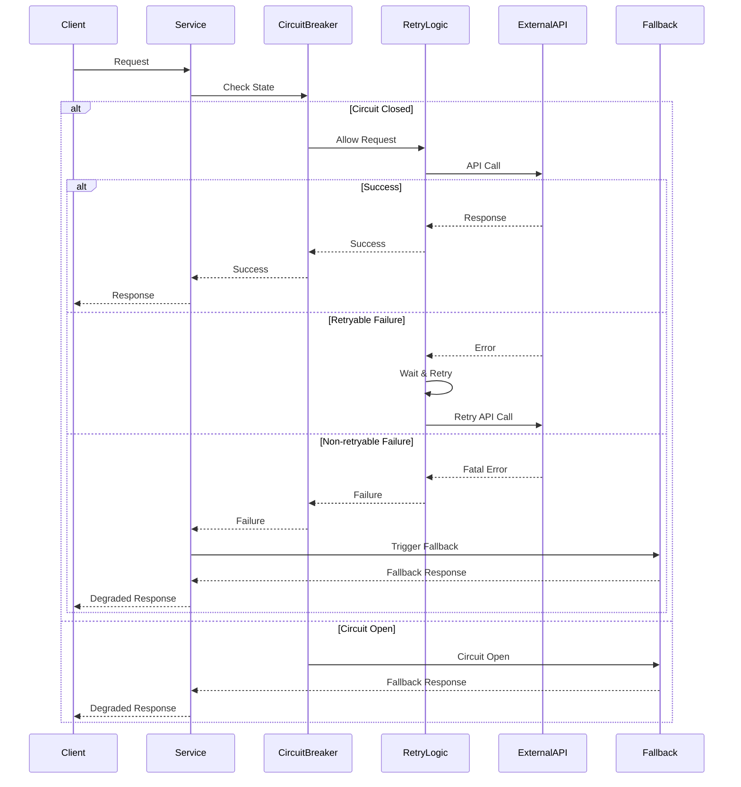


## 8. Implementation Roadmap

### Phase-Based Development Approach

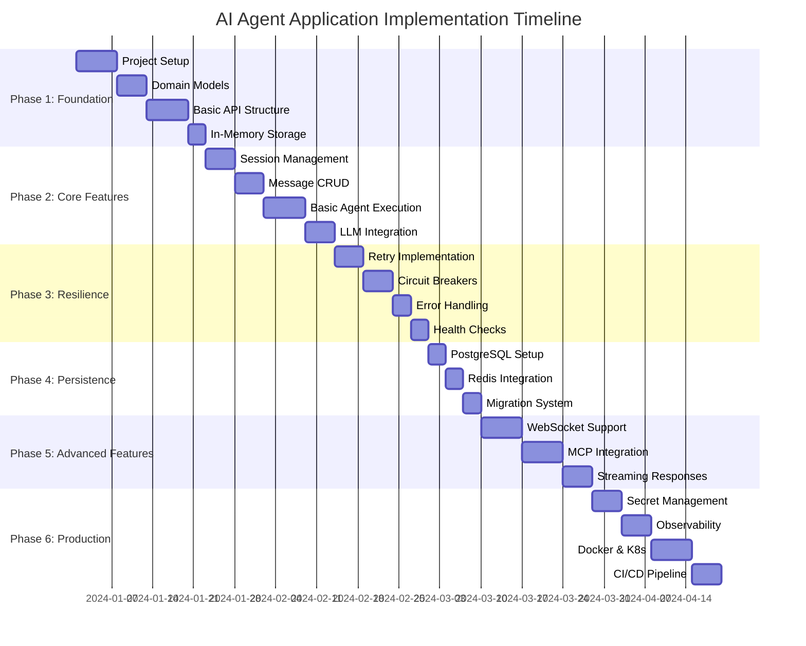

### Phase 1: Foundation (Weeks 1-3)

**Objectives**: Establish project structure, core domain models, and basic API framework

**Deliverables**:
1. **Project Setup**
   - UV workspace configuration
   - Development environment setup
   - Pre-commit hooks and linting
   - Basic CI/CD pipeline

2. **Domain Models**
   - Pydantic v2 models for all entities
   - Exception hierarchy implementation
   - Type definitions and enums

3. **Basic API Structure**
   - FastAPI application setup
   - Router organization
   - Request/response models
   - OpenAPI documentation

4. **In-Memory Storage**
   - Repository pattern implementation
   - Basic CRUD operations
   - Development data persistence

### Phase 2: Core Features (Weeks 4-6)

**Objectives**: Implement core business functionality

**Deliverables**:
1. **Session Management**
   - Session CRUD operations
   - User session association
   - Session lifecycle management

2. **Message Handling**
   - Message CRUD with pagination
   - Message threading support
   - Content search functionality

3. **Basic Agent Execution**
   - LangGraph workflow implementation
   - Simple agent execution engine
   - Tool calling framework

4. **LLM Integration**
   - OpenAI client implementation
   - Provider abstraction layer
   - Response streaming support

### Phase 3: Resilience (Weeks 7-8)

**Objectives**: Implement resilience patterns for production readiness

**Deliverables**:
1. **Retry Implementation**
   - Tenacity-based retry decorators
   - Service-specific retry configurations
   - Exponential backoff with jitter

2. **Circuit Breakers**
   - Circuit breaker implementation
   - State management and metrics
   - Fallback strategy framework

3. **Error Handling**
   - Comprehensive exception handling
   - Standardized error responses
   - Correlation ID tracking

4. **Health Checks**
   - Service health monitoring
   - Dependency health checks
   - Health endpoint implementation

### Phase 4: Persistence (Week 9)

**Objectives**: Add production-grade persistence options

**Deliverables**:
1. **PostgreSQL Integration**
   - Database schema implementation
   - AsyncPG connection pooling
   - Repository implementations

2. **Redis Integration**
   - Redis client setup
   - Session state caching
   - Cache invalidation strategies

3. **Migration System**
   - Alembic migration setup
   - Schema versioning
   - Data migration scripts

### Phase 5: Advanced Features (Weeks 10-12)

**Objectives**: Implement advanced functionality for real-time and MCP integration

**Deliverables**:
1. **WebSocket Support**
   - WebSocket connection management
   - Real-time event system
   - Client state synchronization

2. **MCP Integration**
   - MCP protocol implementation
   - Tool discovery and registration
   - Dynamic tool loading

3. **Streaming Responses**
   - Server-sent events
   - Streaming agent responses
   - Progress tracking

### Phase 6: Production Readiness (Weeks 13-15)

**Objectives**: Production deployment and monitoring

**Deliverables**:
1. **Secret Management**
   - Multi-cloud secret providers
   - Secret rotation automation
   - Development/production separation

2. **Observability**
   - Structured logging implementation
   - Metrics collection and exposition
   - Distributed tracing setup

3. **Containerization**
   - Multi-stage Docker builds
   - Kubernetes manifests
   - Helm charts for deployment

4. **CI/CD Pipeline**
   - Automated testing
   - Security scanning
   - Automated deployment

## 9. Conclusion and Next Steps

This comprehensive architecture plan provides a robust foundation for building a production-ready AI agent application with the following key characteristics:

### ✅ Architecture Achievements

- **🎯 Type Safety**: Complete Pydantic v2 integration with strong typing
- **🔄 Resilience**: Built-in retry logic, circuit breakers, and graceful degradation
- **📈 Scalability**: Horizontal scaling with Redis/PostgreSQL backend options
- **🔌 Extensibility**: Plugin architecture for MCP servers and LLM providers
- **📊 Observability**: Comprehensive logging, metrics, and distributed tracing
- **🏗️ Production Ready**: Docker, Kubernetes, and CI/CD pipeline support
- **🔒 Security**: Enterprise-grade secret management and authentication
- **⚡ Performance**: Async throughout, connection pooling, and caching strategies

### 🚀 Ready for Implementation

The architecture plan includes:
1. **Complete domain models** with strong typing and validation
2. **Comprehensive API specification** with full CRUD operations
3. **Resilience patterns** for external service integration
4. **Multi-environment configuration** management
5. **Production deployment** strategies
6. **Development workflow** and testing approaches

### 📋 Immediate Next Steps

1. **Environment Setup**: Initialize UV workspace and development environment
2. **Domain Implementation**: Create Pydantic models and exception hierarchy
3. **API Development**: Implement FastAPI routers and endpoints
4. **Resilience Integration**: Add retry logic and circuit breakers
5. **Testing Strategy**: Implement comprehensive test suite
6. **Documentation**: Create developer and deployment documentation

This architecture provides a solid foundation that can evolve from a simple prototype to an enterprise-scale AI agent platform, with built-in resilience and observability from day one.
