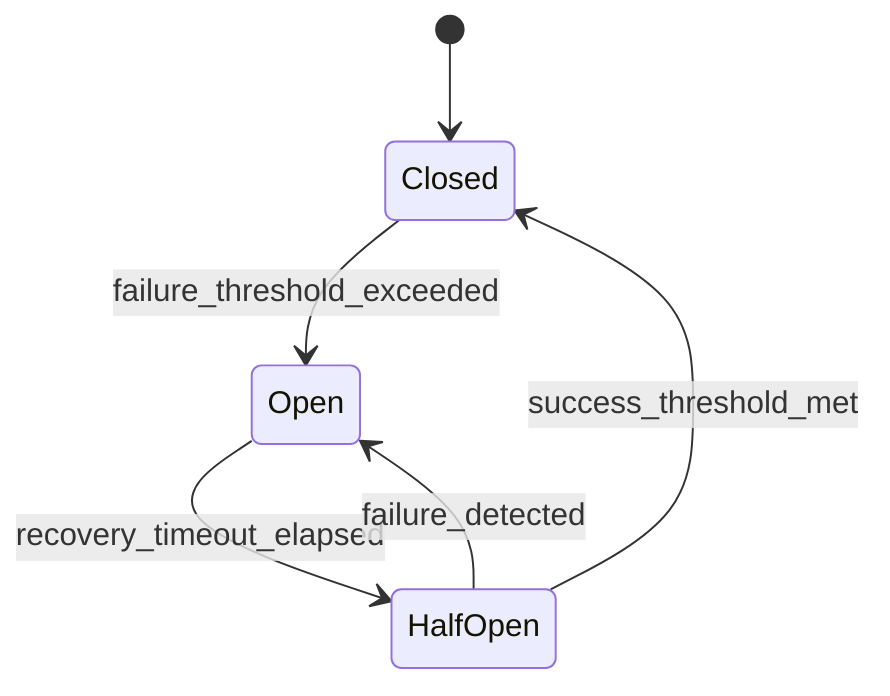
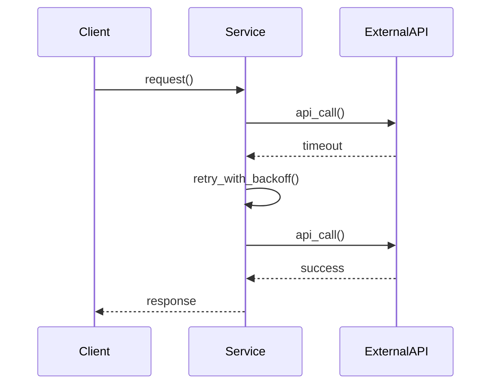
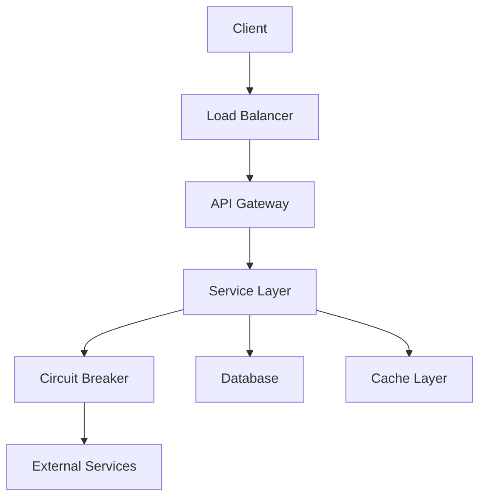
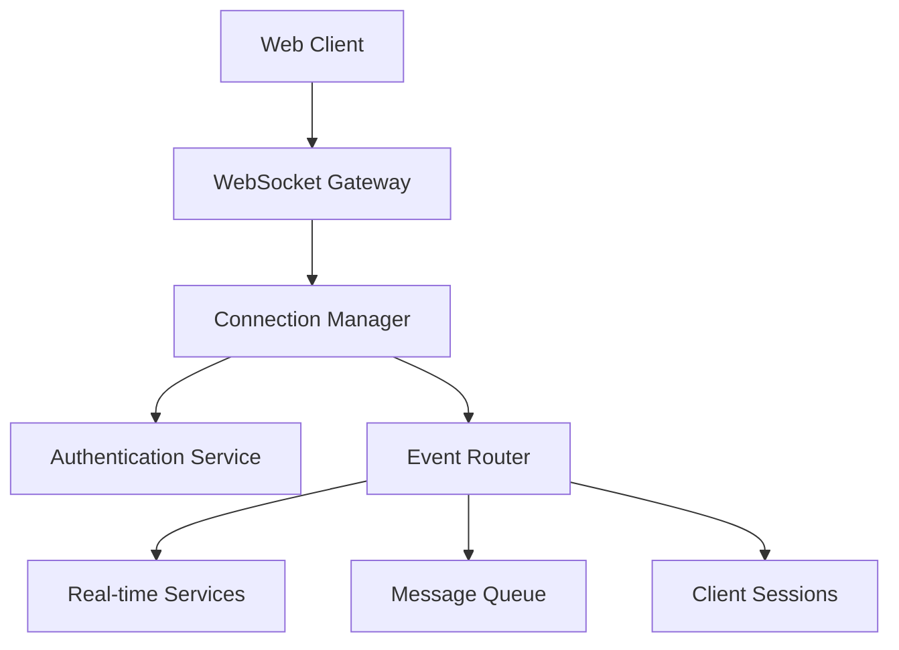
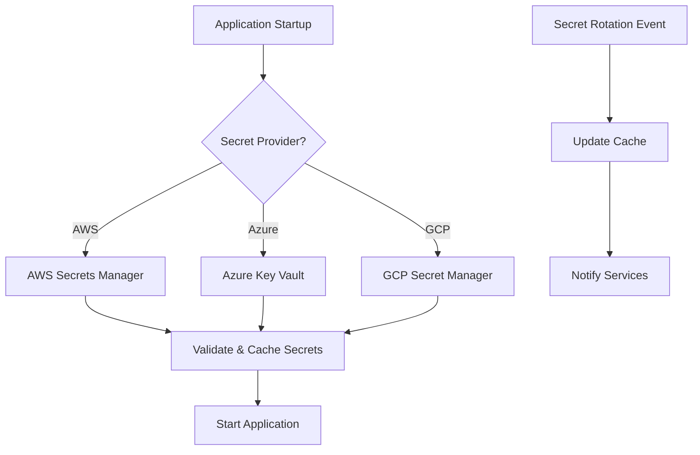
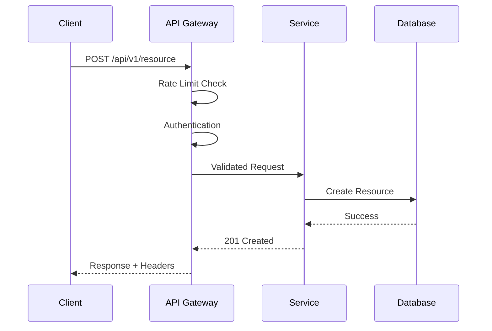

# Context
You are an expert software architect. I need you to create a comprehensive plan for building an **AI agent application** under @implementation with the following requirements:

## Core Requirements
- Technology stack: **Python 3.12+, LangGraph, MCP servers, FastAPI**
- Primary use case: **AI agent that uses MCP servers for tool integration and LangGraph for workflow orchestration**
- Target deployment: **Cloud-ready with local development support**
- Performance requirements: **Sub-second response times, horizontal scaling capability**

## Architecture Constraints
- Avoid vendor lock-in to **LangChain ecosystem (except LangGraph)**
- Use **direct LLM provider SDKs** for **maximum flexibility and control**
- Must be strongly typed using **Pydantic v2**
- Package management with **uv**

## Infrastructure Requirements
- State management: **Session-based conversation state**
- Choose ONE persistence backend from: **Memory, Redis, PostgreSQL**
- Deployment environments: **Development (memory), Production (Redis/PostgreSQL)**
- Containerisation: **Docker with multi-stage builds**

## Resilience & External Service Integration Requirements
- **Retry Logic**: All external service calls must implement sophisticated retry mechanisms
- **Circuit Breaker Pattern**: Critical external dependencies must have circuit breakers
- **Graceful Degradation**: System must continue operating when external services fail
- **Rate Limiting**: Implement both client-side and server-side rate limiting
- **Timeout Management**: Configurable timeouts for all external calls
- **Error Classification**: Distinguish between retryable and non-retryable errors

### Specific Retry Requirements
- Use **tenacity** or similar library for retry decorators
- Implement **exponential backoff** with jitter
- Configure **max retry attempts** per service type
- Add **retry delay multipliers** and **maximum delays**
- Include **before/after retry logging** for observability
- Support **conditional retries** based on error types

### External Service Categories
For each external service type, specify retry behavior:
- **LLM APIs**: Rate limits, timeouts, model availability
- **Database connections**: Connection failures, deadlocks
- **Third-party APIs**: Rate limits, service unavailability
- **File storage**: Network issues, quota exceeded
- **Message queues**: Connection issues, broker failures

## Code Quality Standards
- Static typing throughout
- Comprehensive testing strategy (including retry scenarios)
- Linting and formatting tools
- CI/CD pipeline requirements
- Documentation standards
- **Resilience testing**: Chaos engineering practices

## Deliverables Required

### 1. Domain Model
- Core entities and their relationships
- Strongly-typed data models
- Business logic abstractions
- **Error hierarchy and exception handling strategy**
- **Mermaid entity relationship diagrams** showing domain model structure

### 2. Project Structure
- Complete folder hierarchy
- File organization principles
- Separation of concerns
- Plugin/extension architecture
- **Resilience layer organization** (retries, circuit breakers, fallbacks)

### 3. Configuration Management
- Environment-specific configurations
- Secret management approach
- Runtime configuration loading
- Multi-environment deployment
- **Retry and timeout configuration per environment**
- **Feature flags for resilience mechanisms**

### 4. Infrastructure Strategy
- Choose appropriate persistence layer
- Deployment architecture options
- Scaling considerations
- Infrastructure dependencies
- **External service dependency mapping**
- **Failure mode analysis and mitigation strategies**

### 5. Development Tooling
- Package management setup
- Code quality tools configuration
- Testing framework setup
- CI/CD pipeline definition
- **Resilience testing tools and practices**
- **Load testing and chaos engineering setup**

### 6. Deployment Strategy
- Docker configurations for different environments
- Environment-specific deployment files
- Scaling and monitoring considerations
- Production readiness checklist
- **Service mesh configuration for resilience**
- **Health check and liveness probe strategies**

### 7. External Service Integration Patterns
- **Abstract service interfaces** with multiple implementations
- **Provider factory patterns** for swappable implementations
- **Retry decorator implementations** with configuration
- **Circuit breaker implementations** with metrics
- **Fallback and degraded mode strategies**
- **Service discovery and load balancing**
- **Mermaid sequence diagrams** for service call flows with retry logic
- **Mermaid state diagrams** for circuit breaker state transitions

### 8. Comprehensive API Design
- **Complete REST API specification** with all CRUD endpoints
- **API versioning strategy** and backward compatibility
- **Request/response models** with comprehensive validation
- **Error response standardization** across all endpoints
- **OpenAPI/Swagger documentation** with examples
- **API rate limiting and throttling** implementation
- **Pagination and filtering patterns** for list endpoints
- **Bulk operations support** where appropriate

### 9. Real-Time Communication Architecture
- **WebSocket connection management** and scaling patterns
- **Real-time event system** with pub/sub capabilities
- **WebSocket authentication and authorization** mechanisms
- **Connection state management** and recovery strategies
- **Real-time data synchronization** across multiple clients
- **WebSocket load balancing** and clustering support
- **Event-driven architecture** with message routing
- **Live updates and notifications** system design

### 10. Enterprise Secret Management
- **Multi-cloud secret provider** integration (AWS, Azure, GCP)
- **Secret rotation strategies** and automation
- **Secret audit trails** and access logging
- **Environment-specific secret** management patterns
- **Secret validation and health checks** implementation
- **Runtime secret loading** without service restart
- **Secret encryption at rest** and in transit
- **Compliance and governance** for secret access

### 11. Advanced Integration Capabilities
- **Dynamic service discovery** and registration
- **Hot-reloading of external services** without downtime
- **Service versioning and compatibility** management
- **Advanced retry strategies** with custom backoff algorithms
- **Intelligent routing and load balancing** based on service health
- **Service mesh integration** patterns
- **Advanced monitoring and analytics** for service interactions
- **Multi-tenant service isolation** and resource management

### 12. Observability and Monitoring
- **Retry attempt logging and metrics**
- **Circuit breaker state monitoring**
- **External service latency and error rate tracking**
- **Distributed tracing for service calls**
- **Alerting on retry exhaustion and circuit breaker trips**

## Visual Documentation Requirements

Include **Mermaid diagrams** throughout the plan to provide clear visual documentation:

### Required Diagram Types
- **Entity Relationship Diagrams** - Domain model structure and relationships
- **State Diagrams** - Circuit breaker states, retry workflows, service health states
- **Sequence Diagrams** - Service call flows, retry sequences, error handling flows
- **Flowcharts** - Decision trees for error classification, deployment processes
- **Architecture Diagrams** - High-level system context, service dependencies
- **Gitgraph Diagrams** - Branching strategies and CI/CD workflow visualization

### Diagram Integration
- All diagrams must render properly in Markdown
- Include diagrams inline within relevant sections
- Provide clear titles and descriptions for each diagram
- Use consistent styling and naming conventions
- Ensure diagrams complement and enhance written documentation

## Output Format

Provide a comprehensive plan that includes:

1. **Executive Summary** - High-level architecture decisions and rationale
2. **Domain Model** - Core entities with strongly-typed definitions, error handling, and **ER diagrams**
3. **Project Structure** - Complete folder/file hierarchy with explanations and **architecture diagrams**
4. **Technology Stack** - Specific versions and justifications (include resilience libraries)
5. **Configuration Strategy** - Environment management and secrets handling with **flowcharts**
6. **Infrastructure Options** - Different deployment scenarios with trade-offs and **deployment diagrams**
7. **API Specification** - Complete endpoint documentation with CRUD operations and **API flow diagrams**
8. **Real-Time Architecture** - WebSocket and event-driven design with **connection diagrams**
9. **Secret Management** - Multi-cloud secret handling with **security diagrams**
10. **Development Setup** - Step-by-step developer onboarding with **workflow diagrams**
11. **Deployment Configurations** - Production-ready Docker/K8s manifests with **gitgraph diagrams**
12. **Implementation Roadmap** - Phased development approach with **timeline diagrams**
13. **Decision Matrix** - When to choose different configuration options with **decision flowcharts**
14. **🆕 Resilience Architecture** - Comprehensive retry, circuit breaker, and fallback strategies with **state diagrams**
15. **🆕 External Service Integration** - Detailed patterns for robust external service calls with **sequence diagrams**
16. **🆕 Advanced Integration Patterns** - Dynamic service management and hot-reloading with **service topology diagrams**

## Enhanced Quality Criteria

The plan must be:
- ✅ **Production-ready** - Suitable for enterprise deployment
- ✅ **Scalable** - Can grow from prototype to enterprise
- ✅ **Maintainable** - Clear structure and documentation
- ✅ **Testable** - Comprehensive testing strategy
- ✅ **Flexible** - Easy to extend and modify
- ✅ **Type-safe** - Strong typing throughout
- ✅ **Cloud-native** - Modern deployment practices
- 🆕 ✅ **Resilient** - Graceful handling of external service failures
- 🆕 ✅ **Observable** - Comprehensive monitoring of retry and failure patterns
- 🆕 ✅ **Configurable** - Runtime adjustment of resilience parameters
- 🆕 ✅ **Fault-tolerant** - System continues operating during partial failures
- 🆕 ✅ **API-Complete** - Comprehensive endpoint coverage with proper CRUD operations
- 🆕 ✅ **Real-Time Ready** - WebSocket and event-driven architecture support
- 🆕 ✅ **Secure** - Enterprise-grade secret management and security patterns

## Specific Implementation Requirements

### Retry Implementation Checklist
- [ ] **Tenacity integration** with proper async support
- [ ] **Exponential backoff** with configurable base and multiplier
- [ ] **Maximum delay limits** to prevent excessive wait times
- [ ] **Jitter addition** to prevent thundering herd
- [ ] **Error classification** (retryable vs non-retryable)
- [ ] **Retry attempt logging** with correlation IDs
- [ ] **Metrics collection** for retry success/failure rates
- [ ] **Configuration per service** type and environment
- [ ] **Dead letter queue** handling for permanent failures
- [ ] **Retry budget** limiting to prevent cascading failures

### Circuit Breaker Implementation Checklist
- [ ] **Failure threshold** configuration
- [ ] **Recovery timeout** settings
- [ ] **Half-open state** testing logic
- [ ] **Metrics exposition** for monitoring
- [ ] **Fallback strategy** definition
- [ ] **Manual circuit control** for emergency situations
- [ ] **Mermaid state diagram** showing circuit breaker transitions

### External Service Abstraction Checklist
- [ ] **Provider interface** definitions
- [ ] **Factory pattern** for provider instantiation
- [ ] **Configuration-driven** provider selection
- [ ] **Mock implementations** for testing
- [ ] **Health check** integration
- [ ] **Service registry** pattern where applicable

### API Design Implementation Checklist
- [ ] **Complete CRUD endpoints** for all major entities
- [ ] **RESTful resource design** with consistent patterns
- [ ] **API versioning strategy** (URL path, header, or query parameter)
- [ ] **Request/response validation** with comprehensive error messages
- [ ] **Pagination and filtering** for list endpoints
- [ ] **Bulk operations** for efficient data manipulation
- [ ] **OpenAPI specification** with examples and documentation
- [ ] **Rate limiting and throttling** per endpoint and user
- [ ] **API key management** and authentication patterns
- [ ] **Error response standardization** across all endpoints

### WebSocket Implementation Checklist
- [ ] **Connection management** with authentication
- [ ] **Real-time event broadcasting** to connected clients
- [ ] **Connection state tracking** and recovery
- [ ] **Message queuing** for offline clients
- [ ] **WebSocket clustering** for horizontal scaling
- [ ] **Authentication over WebSocket** using tokens or sessions
- [ ] **Event routing and filtering** based on user permissions
- [ ] **Connection heartbeat** and health monitoring
- [ ] **Graceful connection handling** during deployments
- [ ] **Real-time data synchronization** across multiple clients

### Secret Management Implementation Checklist
- [ ] **Multi-cloud provider support** (AWS Secrets Manager, Azure Key Vault, GCP Secret Manager)
- [ ] **Secret rotation automation** with zero-downtime updates
- [ ] **Secret audit logging** for compliance and security
- [ ] **Environment-specific secret** isolation and management
- [ ] **Secret validation and health checks** during startup
- [ ] **Runtime secret reloading** without service restart
- [ ] **Secret encryption** at rest and in transit
- [ ] **Secret access control** with fine-grained permissions
- [ ] **Secret versioning and rollback** capabilities
- [ ] **Development secret management** with local overrides

### Advanced Integration Implementation Checklist
- [ ] **Dynamic service discovery** and automatic registration
- [ ] **Hot-reloading capabilities** for configuration and services
- [ ] **Service versioning** with backward compatibility
- [ ] **Intelligent load balancing** based on service health and performance
- [ ] **Service mesh integration** for advanced traffic management
- [ ] **Multi-tenant isolation** with resource quotas
- [ ] **Advanced monitoring** with custom metrics and analytics
- [ ] **Service dependency mapping** and impact analysis
- [ ] **Automated failover** and disaster recovery patterns
- [ ] **Performance optimization** with caching and connection pooling

Focus on creating a starter application that serves as a foundation for building resilient, production-ready applications that gracefully handle external service dependencies and failures.

## Example Resilience Scenarios to Address

### LLM API Integration
- Rate limit exceeded → Exponential backoff retry
- Model temporarily unavailable → Circuit breaker with fallback model
- Authentication error → No retry, immediate failure
- Timeout → Retry with increased timeout
- Service overloaded → Circuit breaker with degraded response

### Database Operations
- Connection timeout → Retry with connection pool refresh
- Deadlock detected → Retry with randomized delay
- Connection pool exhausted → Circuit breaker with in-memory fallback
- Primary database down → Automatic failover to read replica

### Third-Party APIs
- 429 Rate Limited → Respect retry-after header
- 502/503 Service Unavailable → Exponential backoff retry
- 401 Unauthorized → No retry, refresh credentials
- Network timeout → Retry with progressive timeout increase
- Service deprecated → Circuit breaker with alternative service

### WebSocket Connection Scenarios
- Connection dropped → Automatic reconnection with exponential backoff
- Authentication expired → Re-authenticate and reconnect
- Message delivery failure → Queue and retry with acknowledgment
- Server overloaded → Circuit breaker with graceful degradation
- Network partition → Local state preservation and sync on reconnect

### Secret Management Scenarios
- Secret rotation required → Zero-downtime secret update
- Secret provider unavailable → Fallback to cached secrets with TTL
- Secret validation failure → Immediate alert and fallback strategy
- Unauthorized secret access → Audit log and deny with notification
- Secret expired → Automatic renewal or manual intervention alert

### Advanced Integration Scenarios
- Service discovery failure → Fallback to static configuration
- Hot-reload configuration change → Gradual rollout with health checks
- Service version incompatibility → Automatic fallback to compatible version
- Load balancer failure → Direct service communication with circuit breaker
- Multi-tenant resource exhaustion → Isolation and throttling per tenant

Your architecture plan should demonstrate how to handle these scenarios systematically and configurably.

## Mermaid Diagram Examples to Include

### Example State Diagram Requirements

### Example Sequence Diagram Requirements

### Example Architecture Diagram Requirements

### Example WebSocket Architecture Diagram

### Example Secret Management Flow Diagram

### Example API Flow Diagram

Include similar diagrams throughout your architecture plan to visualise workflows, state transitions, system interactions, and real-time communication patterns.
